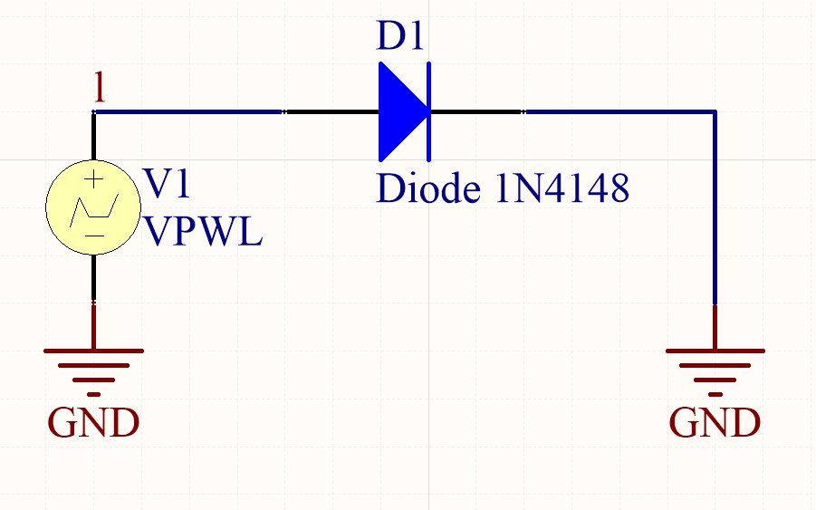

# Preparation Notebook - ECD - GEL2002

## LAB1 - Diodes [Protocol](GEL2002_Lab1_A19.pdf)

###  Preparation

Paramètres de la diode 1N4148 [Datasheet](1N914-1N4148.pdf)

- V~F~ = 1.0V @ 10mA
- I~R~ = 25nA @ 20V
- $R_d = ​$

Simulation altium

À partir de la courbe générée en simulation, on peut retrouver un $R_d=\frac{\Delta{V}}{\Delta{I}}=16.6\Omega$ 

IL s'agira de mesurer la variation de la courbe *iv* en fonction de la température. Un thermomètre variable programmable sera utilisé avec un arduino. [Datasheet thermomèetre](DS18B20.pdf)

### Experience

