# LAB1 - Diodes

###  1.Preparation

1.1- Paramètres de la diode 1N4148 [Datasheet](1N914-1N4148.pdf)

- V~F~ = 1.0V @ 10mA
- I~R~ = 25nA @ 20V

1.4 - Simulation Altium

À partir de la courbe générée en simulation, on peut retrouver un $R_d=\frac{\Delta{V}}{\Delta{I}}=16.6\Omega$ 

On remarque qu'altium utilise le modèle exponentiel.

Il s'agira de mesurer la variation de la courbe *iv* en fonction de la température. Un thermomètre variable programmable sera utilisé avec un arduino. [Datasheet thermomèetre](DS18B20.pdf)

### Experience au laboratoire

#### 2. Diodes à jonction PN

**2.1 - Courbe i-v**

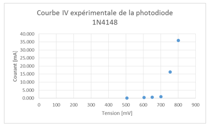

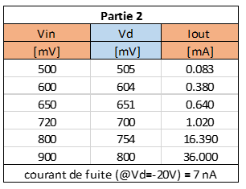

**2.2 - Coefficient n**

$$n=\frac{V_2-V_1}{V_T\ln[I_2/I_1]} = \frac{0.800-0.754}{0.0257\cdot\ln(36/16)}\approx2.3$$

La valeur calculée correspond approximativement à la valeur théorique des diodes discrètes qui est de 2.

**2.3 - Courant de fuite**

Le courant de fuite mesuré à $-20.0V​$ est de $7nA​$. Cela est conforme à la fiche technique de la diode qui assure un courant de fuite $<25nA​$.

**2.4 - Comparaisons**

*Simulation:*

- $R_d=\frac{\Delta V}{\Delta I}=\frac{1-0.75}{0.02-0.007}=19.9.​$

*Expérience:*

- $R_d=\frac{0.8-0.754}{0.036-0.016} \approx 3.3$
- $n\approx 2.3$

*Datasheet:*

- $R_d \approx 1.8​$
- $n\approx 2​$

Les valeurs expérimentales semblent se rapprocher bien plus des valeurs de la datasheet que des valeur calculées à partir de la simulation. Peut-être que le modèle de simulation sélectionné n'était pas le bon ou que la simulation a été effectuée avec les mauvais paramètres. Parmis les modèles utilisés pour modéliser le comportement d'une diode, il y a le modèle idéal, le modèle linéaire et le modèle exponentiel.

- Modèle idéal: (+) Très simple, rapide; (-) Faux, pas utilisable en pratique
- Modèle linéaire: (+) Approximatif, rapide, simple; (-) Ne tient pas en compte la zone de transition entre le blocage et la zone d'opération linéaire
- Modèle exponentiel: (+) Modélisation juste; (-) Plus complexe que les autres modèles

#### 3. Effets de la température sur la diode à jonction PN

Le circuit suivant a été effectué:

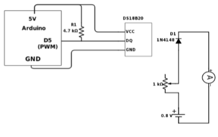

Le potentiomètre a été ajusté afin d'obtenir $i_D=50mA$
La diode a ensuite été refroidie. Le courant de 50mA a été maintenu afin d'observer le décalage de voltage au borne de la diode en fonction de la température. Un décalage d'environ $-2mV/^\circ C$ a été observé, comme présenté sur le graphique ci-dessous. Cette valeur est également ce qui est présenté dans la datasheet de la diode 1N4148 à la Figure 6.

 

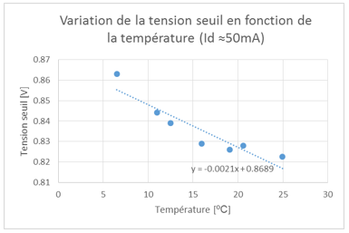

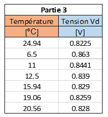

#### 4.Diode Schottky et le redressement

**4.1 - iv Schottky **
Le circuit suivant a été réalisé

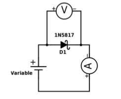

**4.1 -** Les mesures suivantes ont été prises:

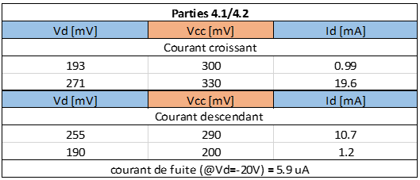

On remarque une hystérésis dans la courbe i-v de la diode. Celle-ci est probablement dû au décalage de la courbe i-v de la diode en fonction de la température. L'augmentation de température est causée par le passage du courant dans la diode.

**4.2 - Courant de fuite**
Le courant de fuite mesuré à -20.0V aux bornes de la diode est de 5.9uA.

**4.3 - Diode 1N5817**

- $r_d = $ $\frac{\Delta V}{\Delta I}=\frac{0.078}{0.0186}=4.19\Omega$
- $V_{th} \approx 200mV $, environ comme l'indique la fiche technique.

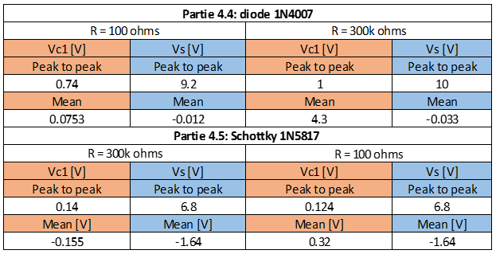

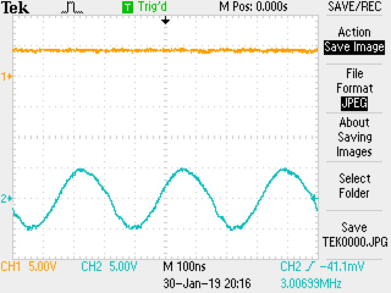

*Rectification simple d'un signal sinusoïdal à l'aide d'une diode et d'une résistance de 300kOhms.*

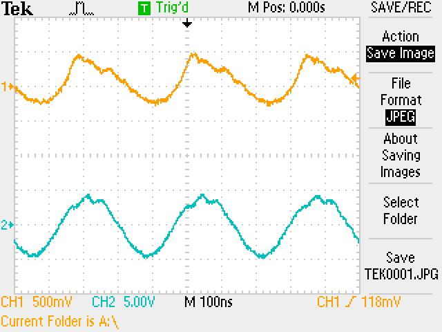

*Rectification simple d'un signal sinusoïdal à l'aide d'une diode et d'une résistance de 100Ohms.*

On observe ici que le redressement dépend de la vitesse de décharge du condensateur qui dépend de la constante RC.

La diode du circuit a été remplacée par une diode 1N5817 afin de vérifier l'impact sur la rectification. 

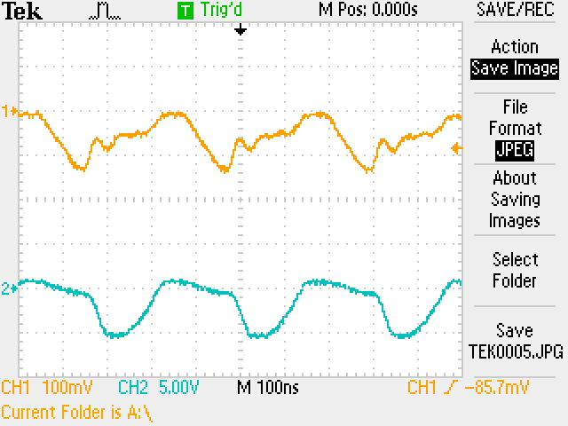

*Rectification simple d'un signal sinusoïdal à l'aide d'une diode et d'une résistance de 300kOhms avec une diode 1n5817.*

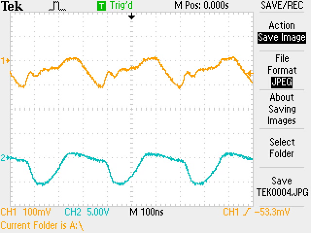

*Rectification simple d'un signal sinusoïdal à l'aide d'une diode et d'une résistance de 100Ohms avec une diode 1n5817.*

On remarque que la rectification n'a pas été améliorée par l'augmentation de la résistance. Il est possible qu'une erreur dans le circuit ait causé ces mauvais résultats. On remarque même que le signal source est influencé par le circuit.

On peut discuter de l'utilisation d'une diode schottky pour le redressement. La Schottky possède une tension seuil plus basse, ce qui permet de dissiper moins de puissance en pertes calorifiques. Également, le temps de réponse des diodes schottky est largement supérieur, cela peut être utile pour une source alternative rapide. Le désavantage de la Schottky est son courant de fuite en polarisation inverse qui est de l'ordre des uA, ce qui est plus important que les diodes normales.

#### 5.Diode Zener

**5.1 -  courbe i-v**

Le montage suivant a été réalisé:

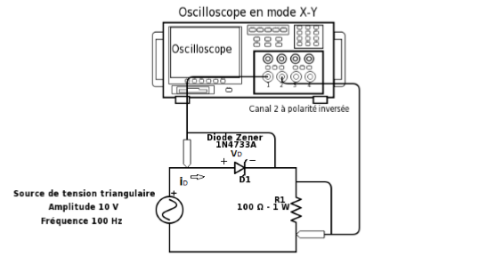

La courbe i-v suivante a été mesurée sur l'oscilloscope:

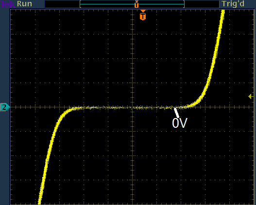

La courbe observée est fidèle aux indications de la fiche technique de la diode 1N4733A. La tension de seuil correspond environ au 1.2V indiqué et la tension de zener à -5V environ.

#### 6. Protection

La charge inductive permet d'emmagasiner de l'énergie sous forme de champ magnétique. La tension à ses bornes est déterminée par l'équation $dV = L\frac{dI}{dt}$. Ainsi, couper la source de courant induit un $\frac{dI}{dt}$ élevé qui engendre donc une tension très élevée aux bornes de la bobine. Cette tension peut engendrer des courts-circuits.

Le circuit suivant a été réalisé:

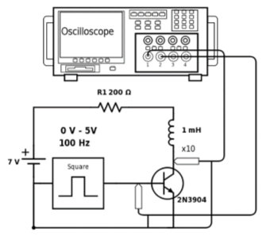

La mesure des pics de tension aux bornes de la bobine ont révélé une tension maximale d'environ 118V.

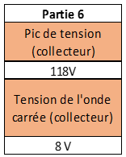

On observe les pics de tensions mesurés avec diode de protection. Il s'agit d'un grossissement des pics de tension. On remarque que la tension maximale est beaucoup moins importante que le 118V mesuré sans protection.

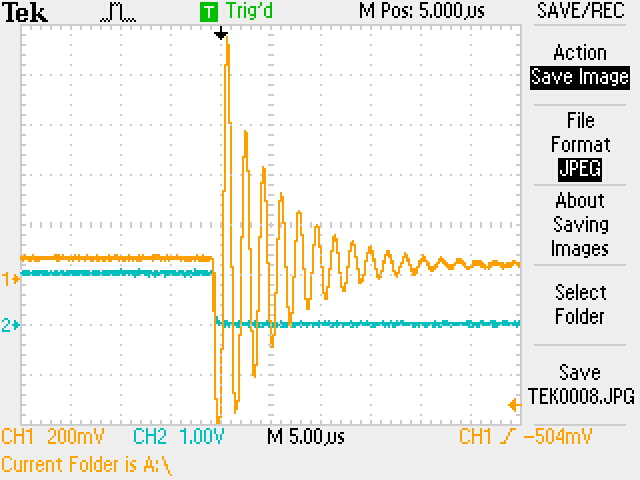

Une augmentation de la fréquence de commutation diminue l'amplitude des pics de tension aux bornes de l'inductance en raison du temps de réponse intrinsèque de l'inductance. De plus, on peut ajouter une résistance en série avec la diode, afin de limiter les retours de courants importants. Une diode seule peut laisser passer d'importants courants.

#### 7. Détection de l'intensité lumineuse

Le montage suivant a été réalisé:

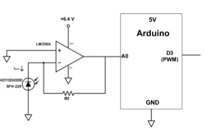

La résistance Rf=300kOhms

**7.2 - Courant de la photodiode**

Le courant traversant la photodiode pour différents degrés d'exposition lumineuse a été mesuré. Les résultats sont présentés dans le tableau suivant:

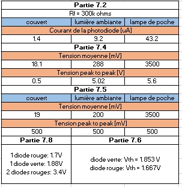

On remarque que le courant de la photodiode n'est pas nul lorsque celle-ci est couverte. On appelle cela le *Dark current*.

**7.3**

Le courant traversant la photodiode engendre un différence de potentiel à l'entrée de l'ampliop, ce qui se traduit par une augmentation de la tension de sortie. L'utilisation d'une résistance Rf élevée permet d'avoir un gain élevé, ce qui permet d'augmenter la différence de potentiel pour une même variation de tension à la photodiode.

**7.4 / 7.5**

Les mesures du PWM avec et sans filtre RC sont présentées dans le tableau ci-dessus.

Variation du Duty-cycle (sans filtre RC)

*PWM mesuré lorsque la photodiode est couverte*

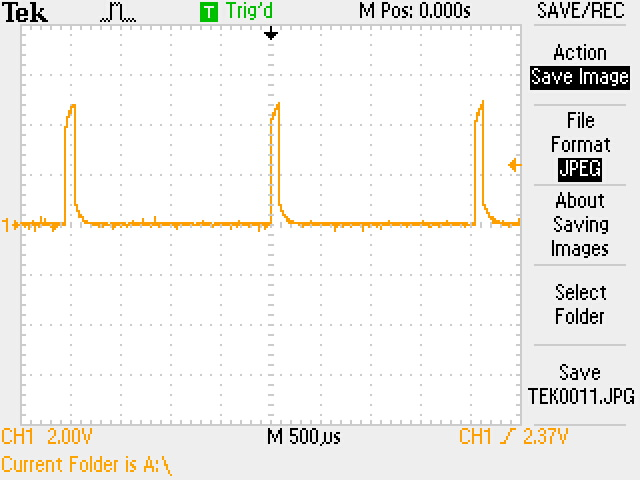

*PWM mesuré lorsque la photodiode est à la lumière ambiante*

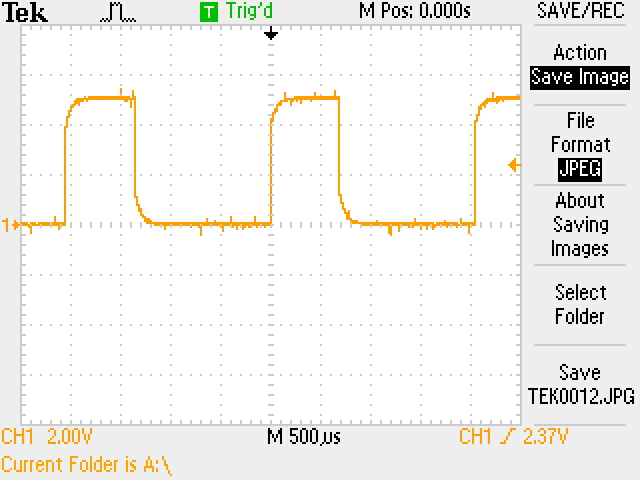

*PWM mesuré lorsque la photodiode est près d'une source lumineuse intense.*

Les mesures suivantes ont étés effectuées avec un filtre RC. On remarque que la composante alternative du signal n'est plus présente et que seulement une tension moyenne est mesurée.

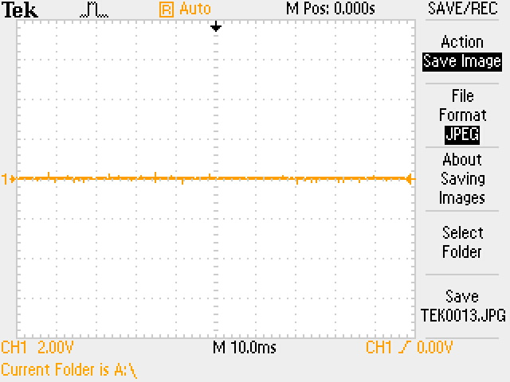

*Signal de sortie filtré lorsque la photodiode est couverte*

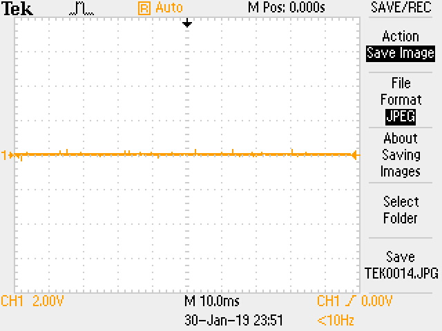

*Signal de sortie filtré lorsque la photodiode est à la lumière ambiante*

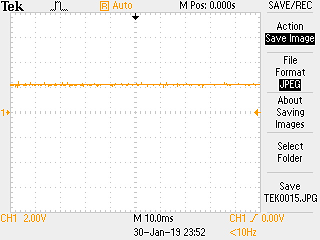

*Signal de sortie filtré lorsque la photodiode est près d'une source lumineuse intense.*

**7.6**

Les mesures des tensions de seuil des DELs sont dans le tableau plus haut.

**7.7**

Le montage suivant a été réalisé:

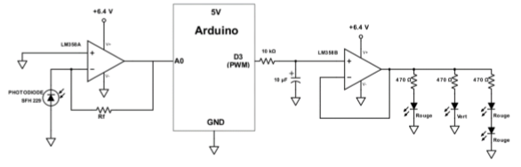

Il est nécessaire d'utiliser un tampon dans le circuit afin de limiter le courant traversant les DEL. Cela permet d'avoir l'intensité lumineuse voulue.

**7.8**

La mesure des tensions de seuil des DELs ont été mesurées et sont présentées dans le tableau plus haut.

1. Oui, les résultats concordent avec les tensions de seuil mesurées en 7.6.
2. Il y aurait diminution de l'intensité lumineuse des DELs.