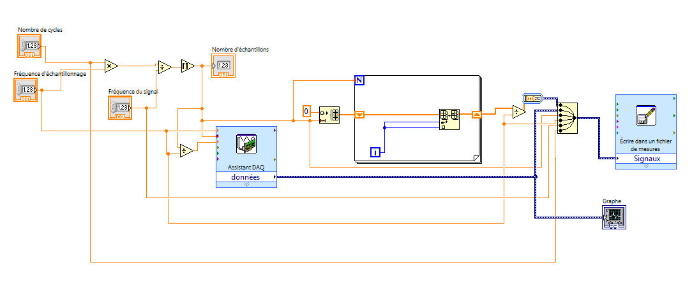
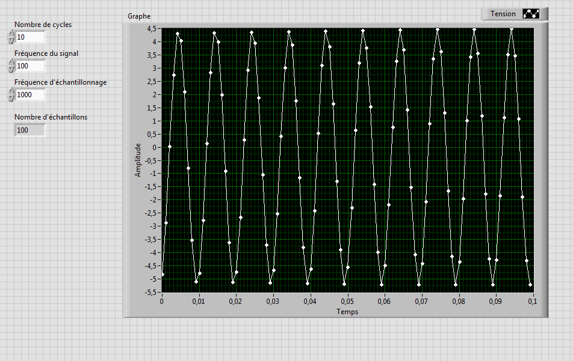
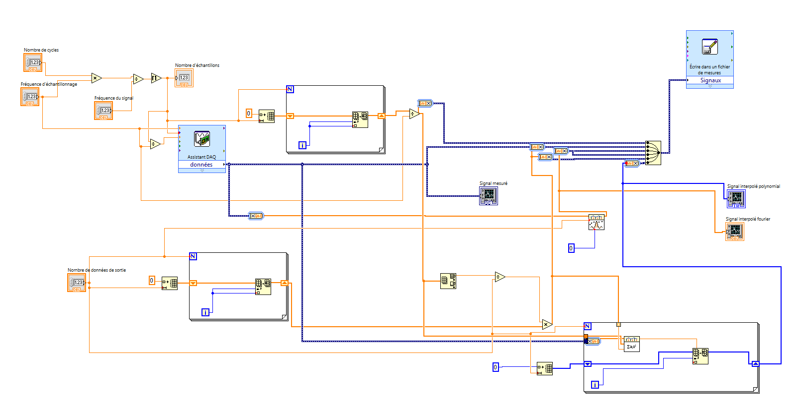

# Cahier de laboratoire - GPH2003 

[TOC]

## LABVIEW

### Préparation

- Langage de programmation **G** .
- Interpolation utilisée entre les données échantillonnées: *Polynomiale* & *Trigonométrique*
- Théorème de Nyquist indique que la fréquence échantillonnage doit être au moins 2 fois plus grande que la fréquence du signal mesuré.

#### But: Reconstruire un signal périodique avec LabVIEW & Nyquist

1.2.1 - Acquisition basique d'un signal

1. Générer une fréquence de 100Hz, amplitude 5V.
2. Brancher *NIDAQ > USB* & *Signal > AI0*.
3. Ouvrir un *VI* et suivre infos dans le protocole pour prendre la mesure.
4. La figure 1.2 montre comment créer un tableau avec des valeurs de temps. Premièrement le tableau est créé, ensuite, il est rempli, puis les valeurs sont divisées par la fréquence d'échantillonnage.
5. Tracer les graphiques

1.2.2 - Paramétrisation

1.2.3 - Reconstruction

1.2.4 - Effet de la fréquence

#### Stratégie du laboratoire:

1. Comprendre comment faire une acquisition sous labVIEW et paramétriser une interface.
2. Reconstruire le signal dans un graphique. Vérifier les différentes stratégies d'interpolation de données. Comparer et utiliser celle qui semble la meilleure pour de données périodiques.
3. Prendre différentes acquisitions de données à différentes fréquences, *sous*, *sur* et *au-dessus* de la fréquence de Nyquist de 2.5*Hz* afin d'étudier l'effet de différentes fréquences échantillonnage.
4. Comparer les résultats avec les deux types d'interpolation et discuter des résultats.

### Séance

Le labVIEW est débuté. Familiarisation grossière avec LabVIEW:

- Clic droit dans le diagramme permet de choisir différentes fonctions afin de faire notre instrument virtuel. 
- La construction de tableau se fait en 2 étapes. On doit initialiser le tableau, puis le remplir à l'aide d'une *Boucle* et de la fonction *Remplacer élément*.
- Entrée d'un tableau dans une boucle doit passer dans un registre à décalage.

La création du VI a été faite selon le protocole:

Un échantillonnage sans entrée a été effectué afin d'observer les variations d'incrémentation du signal du bruit. On voit que les valeurs oscillent à coups de *0.002467+0.000087=.* Cette incrémentation  montre effectivement la résolution pour un VI programmé sur une plage de -5 à 5V. Ainsi, sachant que la carte est programmée sur 12 bits, on pourrait trouver la résolution numérique du signal mesuré en faisant $\frac{10}{4096}=0.00244​$ V

Ensuite, un échantillonnage du signal sinusoidal a été effectué. 
**Paramètres du sinus:** F = 100Hz, CC = 10V
**Paramètres du VI:** Fréquence d'échantillonnage = 1000Hz, Nombre de mesures = 100, Plage = [-5,5], Résolution = 0.00244

Image de la capture Test:

Afin d'effectuer des mesures et de faire de l'interpolation trigonométrique et polynomiale, un Nouveau VI a été construit afin d'avoir ces nouvelles fonctions:

#### Acquisition des données

Tableaux des fichiers utilisés

Les valeurs constantes sont N=10, F=100 et Résolution Interpolation=1000

**Dans les fichiers:**

Colonne 1 = temps absolu
Colonne 2 = temps de mesure
Colonne 3 = Tension
Colonne 4 = polynomial
Colonne 5 = Fourier

| Description           | Fréquence [Hz] |
| --------------------- | -------------- |
| Mesure test du sinus  | 1000           |
| nyquist_data_1000.csv | 1000           |
| nyquist_data_750.csv  | 750            |
| nyquist_data_500.csv  | 500            |
| nyquist_data_400.csv  | 400            |
| nyquist_data_300.csv  | 300            |
| nyquist_data_200.csv  | 200            |
| nyquist_data_100.csv  | 100            |
| nyquist_data_90.csv   | 90             |
| nyquist_data_60.csv   | 60             |
| nyquist_data_30.csv   | 30             |
| nyquist_data_20.csv   | 20             |
| LOGICIEL PLANTE       | 5              |
| LOGICIEL PLANTE       | 2              |

## Capteur de Courant

### Préparation

### Séance

## Capteur de Position Linéaire

### Préparation

### Séance

## Conditionnement

### Préparation

### Séance

## Capteur de Température

### Préparation

### Séance

## Capteur de Position Angulaire

### Préparation

### Séance

## Débitmètre

### Préparation

### Séance

## Capteur de Pression

### Préparation

### Séance

## Jauge de déformation

### Préparation

### Séance