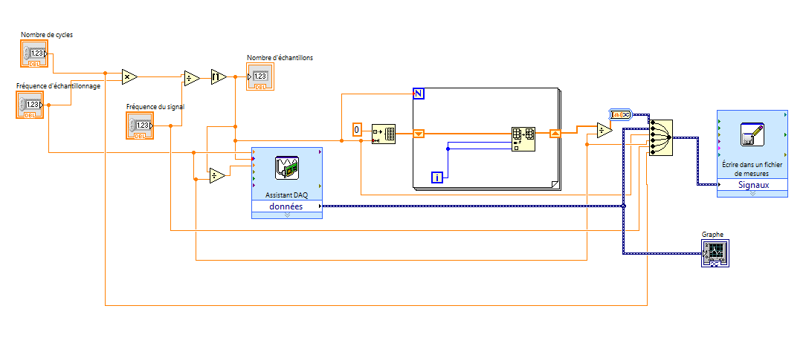

# Cahier de laboratoire - GPH2003 

[TOC]

## LABVIEW

### Préparation

- Langage de programmation **G** .
- Interpolation utilisée entre les données échantillonnées: *Polynomiale* & *Trigonométrique*
- Théorème de Nyquist indique que la fréquence échantillonnage doit être au moins 2 fois plus grande que la fréquence du signal mesuré.

#### But: Reconstruire un signal périodique avec LabVIEW & Nyquist

1.2.1 - Acquisition basique d'un signal

1. Générer une fréquence de 100Hz, amplitude 5V.
2. Brancher *NIDAQ > USB* & *Signal > AI0*.
3. Ouvrir un *VI* et suivre infos dans le protocole pour prendre la mesure.
4. La figure 1.2 montre comment créer un tableau avec des valeurs de temps. Premièrement le tableau est créé, ensuite, il est rempli, puis les valeurs sont divisées par la fréquence d'échantillonnage.
5. Tracer les graphiques

1.2.2 - Paramétrisation

1.2.3 - Reconstruction

1.2.4 - Effet de la fréquence

#### Stratégie du laboratoire:

1. Comprendre comment faire une acquisition sous labVIEW et paramétriser une interface.
2. Reconstruire le signal dans un graphique. Vérifier les différentes stratégies d'interpolation de données. Comparer et utiliser celle qui semble la meilleure pour de données périodiques.
3. Prendre différentes acquisitions de données à différentes fréquences, *sous*, *sur* et *au-dessus* de la fréquence de Nyquist de 2.5*Hz* afin d'étudier l'effet de différentes fréquences échantillonnage.
4. Comparer les résultats avec les deux types d'interpolation et discuter des résultats.

### Séance

Le labVIEW est débuté. Familiarisation grossière avec LabVIEW:

- Clic droit dans le diagramme permet de choisir différentes fonctions afin de faire notre instrument virtuel. 
- La construction de tableau se fait en 2 étapes. On doit initialiser le tableau, puis le remplir à l'aide d'une *Boucle* et de la fonction *Remplacer élément*.
- Entrée d'un tableau dans une boucle doit passer dans un registre à décalage.

La création du VI a été faite selon le protocole:

Un échantillonnage sans entrée a été effectué afin d'observer les variations d'incrémentation du signal du bruit. On voit que les valeurs oscillent à coups de *0.002467+0.000087=.* Cette incrémentation  montre effectivement la résolution pour un VI programmé sur une plage de -5 à 5V. Ainsi, sachant que la carte est programmée sur 12 bits, on pourrait trouver la résolution numérique du signal mesuré en faisant $\frac{10}{4096}=0.00244​$ V

Ensuite, un échantillonnage du signal sinusoidal a été effectué. 
**Paramètres du sinus:** F = 100Hz, CC = 10V
**Paramètres du VI:** Fréquence d'échantillonnage = 1000Hz, Nombre de mesures = 100, Plage = [-5,5], Résolution = 0.00244

Image de la capture Test:

Afin d'effectuer des mesures et de faire de l'interpolation trigonométrique et polynomiale, un Nouveau VI a été construit afin d'avoir ces nouvelles fonctions:

#### Acquisition des données

Tableaux des fichiers utilisés

Les valeurs constantes sont N=10, F=100 et Résolution Interpolation=1000

**Dans les fichiers:**

Colonne 1 = temps absolu
Colonne 2 = temps de mesure
Colonne 3 = Tension
Colonne 4 = polynomial
Colonne 5 = Fourier

| Description           | Fréquence [Hz] |
| --------------------- | -------------- |
| Mesure test du sinus  | 1000           |
| nyquist_data_1000.csv | 1000           |
| nyquist_data_750.csv  | 750            |
| nyquist_data_500.csv  | 500            |
| nyquist_data_400.csv  | 400            |
| nyquist_data_300.csv  | 300            |
| nyquist_data_200.csv  | 200            |
| nyquist_data_100.csv  | 100            |
| nyquist_data_90.csv   | 90             |
| nyquist_data_60.csv   | 60             |
| nyquist_data_30.csv   | 30             |
| nyquist_data_20.csv   | 20             |
| LOGICIEL PLANTE       | 5              |
| LOGICIEL PLANTE       | 2              |

## Capteur de Courant

***date***: 1 février
***coéquipiers***: Anais Parrot & Jordan Bourgault
***but***:comparer deux types de capteurs de courant: résistifs et à effet Hall

### Préparation

#### Les caractéristiques majeures d'un capteur sont souvent

- Étendue (plage) sur laquelle la mesure est valable
- Linéarité du capteur. Est-ce que la réponse du capteur est directement proportionnelle au signal physique mesuré?
- Réponse fréquentielle (rapidité de la réactivité du capteur)
- Résolution (plus petite variation mesurable)
- Sensibilité (gain du capteur, petite variation physique=grande variation signal)

#### Types de capteurs de courant

- Shunt: Résistance connue parcourue par un courant et mesure à ses bornes. Résistance faible pour ne pas influencer la mesure, $\Delta V$ détectable, tolérance élevée.
- Hall: Le champ magnétique produit par le passage du courant dans un fil fait dévier la trajectoire d'électrons et créé une différence de potentiel aux bornes du capteur à cause de cette variation de densité électronique de par et d'autre du capteur. Une gaine coaxiale ne permet pas une mesure par effet hall (faraday effet)

#### Manipulations

##### Shunt

1. Faire le circuit du protocole. Calculer la valeur nécessaire de la résistance ainsi que sa tolérance en puissance

1. Faire varier la tension source jusqu'aux limites de la source/tolérance avec des incréments faibles afin d'avoir une bonne résolution. Mesurer la tension aux bornes de RShunt.
2. Mesurer la résistance totale du circuit avec précision et trouvez le courant en fonction de la tension.
3. Comparer la méthode au point 2 et 4

##### Hall 

### Séance

#### Shunt

0.05V = 0.14A

La résistance $R_{shunt}​$ est beaucoup trop faible pour être mesurée, la résistance des fils est prédominante. Ainsi, on se fie à la datasheet qui dit:

$R_{shunt}=(0.01000\pm0.00003)\Omega​$ 

cette mesure est vérifiée grossièrement en passant un courant dans la résistance, tel qu'il y a une différence de potentiel au borne de la résistance de 10mV. Le courant traversant est alors de 0.1A, ce qui est équivalent à 0.01 Ohms. Cependant, l'incertitude sur la datasheet est plus précise que celle de l'instrumentation utilisée, elle sera donc utilisée.

La résistance totale du circuit est mesurée à l'aide d'un multimètre numérique **Agilent - 34461A**

$R_{circuit}=(2.3\pm0.5)\Omega​$, $P_{max}=(5\pm )W​$

MAX ampérage circuit = 1.5A, donc on se limite à 1A juste par sécurité. ($P = RI^2\rightarrow \sqrt{\frac{P}{R}}=\sqrt{\frac{5}{2.3}}=1.47A​$)

La limitation de la source [**Agilent - U8031A** ]:https://www.keysight.com/en/pd-2054544-pn-U8031A/triple-output-dc-power-supply-30v-6a-2x-375w?nid=-35489.995979.00&cc=CA&lc=eng

est mise à 1A, alors que la tension sera variée jusqu'à l'atteinte de la limite de 1A. Les bons effectués seront de 0.05, ou de 0.1 s'il n'y a pas assez de changement.  

Les branchement initiaux n'étaient pas bon, le courant était envoyé par les branchement où l'on devait prendre la tension aux bornes de RSHUNT et la tension mesurée était aux bornes des fils, donc la résistance était beaucoup trop importante, ainsi que le voltage drop. Le montage a été recommencé et la prise de donnée également.

Il est possible de retrouver le courant du circuit en effectuant le calcul $\Delta V_{shunt}/R_{shunt} = I​$

| Tension source [V$\pm$0.02] | Courant calculé dans $R_{shunt}$ [mA$\pm​$0.3] | Courant Calculé avec $R_{total}$[A$\pm​$0] | Courant sur la source [A$\pm$0.02] |
| --------------------------- | --------------------------------------------- | ----------------------------------------- | ---------------------------------- |
| 0.05                        | 19.4$ \pm 0.1$                                | 0.02$\pm$0.01                             | 0.02                               |
| 0.1                         | 41.5$\pm0.2$                                  | 0.04$\pm$0.02                             | 0.04                               |
| 0.15                        | 63.3$\pm0.2$                                  | 0.07$\pm$0.02                             | 0.06                               |
| .20                         | 85.4$\pm0.3$                                  | 0.09$\pm$0.03                             | 0.09                               |
| .25                         | 107.4$\pm 0.3$                                | 0.11$\pm$0.03                             | 0.11                               |
| .3                          | 129.8$\pm 0.4$                                | 0.13$\pm$0.03                             | 0.13                               |
| .35                         | 151.9$\pm 0.5$                                | 0.15$\pm$0.04                             | 0.15                               |
| .4                          | 173.8$\pm 0.6$                                | 0.17$\pm$0.04                             | 0.17                               |
| .45                         | 195.8$\pm 0.7$                                | 0.20$\pm$0.05                             | 0.2                                |
| .50                         | 217.2$\pm 0.8$                                | 0.22$\pm$0.05                             | .22                                |
| .60                         | 261.4$\pm 0.9$                                | 0.26$\pm$0.06                             | 0.26                               |
| .70                         | 305$\pm1$                                     | 0.30$\pm$0.07                             | 0.31                               |
| .80                         | 349$\pm 2$                                    | 0.35$\pm$0.08                             | 0.35                               |
| .90                         | 392$\pm2$                                     | 0.39$\pm$0.09                             | 0.39                               |
| 1.00                        | 436$\pm2$                                     | 0.4$\pm$0.1                               | 0.44                               |
| 1.10                        | 479$\pm2$                                     | 0.5$\pm$0.1                               | 0.48                               |
| 1.20                        | 523$\pm2$                                     | 0.5$\pm$0.2                               | 0.52                               |
| 1.30                        | 570$\pm2$                                     | 0.6$\pm$0.2                               | 0.57                               |
| 1.40                        | 613$\pm2$                                     | 0.6$\pm$0.2                               | 0.61                               |
| 1.50                        | 651$\pm2$                                     | 0.6$\pm$0.2                               | 0.65                               |
| 1.60                        | 699$\pm2$                                     | 0.7$\pm$0.2                               | 0.7                                |
| 1.70                        | 741$\pm3$                                     | 0.7$\pm$0.2                               | 0.74                               |
| 1.80                        | 783$\pm 3$                                    | 0.8$\pm$0.2                               | 0.78                               |
| 1.90                        | 825 $\pm3$                                    | 0.8$\pm$0.2                               | 0.83                               |
| 2.00                        | 866 $\pm 3$                                   | 0.9$\pm$0.2                               | 0.87                               |
| 2.20                        | 940$\pm 6$                                    | 1.0$\pm$0.3                               | 0.94                               |
| 2.40                        | 1020$\pm10$                                   | 1.0$\pm$0.3                               | 1.02                               |
| 2.60                        | 1100$\pm 10$                                  | 1.1$\pm$0.3                               | 1.10                               |

l'incertitude grandissante à partir de 2.2 est due aux variations qui se voyaient surement à cause du réchauffement du circuit à cause du courant qui le traversait.

Graphique sommaire du calcul des courants selon la tension de RShunt. Graphique sommaire du calcul des courants selon la tension de Rtotal

#### Hall

Construire circuit d'alimentation pour alimenter capteur Hall.

1. Monter le circuit à 4.3
2. Choisir un résistance R (Rtotal remesuré avec les connections =2.87+-0.05 )
3. Garder les mêmes résistances sur le circuit de shunt et mettre de la sur le capteur à effet hall. Prendre les mesures en incrémentant la tension de la même manière qu'avec le shunt afin de tracer la courbe d'étalonnage. le courant passant dans le capteur est de 16.990mA +- 0.1

OFFSET 6.4527$\pm$0.008 

Incertitude l'appareil:

Des bons de 0.2V ont étés fait, car les bons de 0.1 prenaient trop de temps.

| Tension Source [V$\pm$0.02] | Tension de Hall [V$\pm$0.008] | Tension de Hall décalée [V$\pm$0.008] | Courant source [mA $\pm$ 20] |
| --------------------------- | ----------------------------- | ------------------------------------- | ---------------------------- |
| 0.10                        | 6.4510                        | 0.0017                                | 40                           |
| 0.20                        | 6.4492                        | 0.0035                                | 70                           |
| 0.30                        | 6.4472                        | 0.0055                                | 90                           |
| 0.50                        | 6.4436                        | 0.0091                                | 180                          |
| 0.70                        | 6.4400                        | 0.0127                                | 250                          |
| 0.90                        | 6.4360                        | 0.0167                                | 320                          |
| 1.10                        | 6.4323                        | 0.0204                                | 400                          |
| 1.30                        | 6.4288                        | 0.0239                                | 470                          |
| 1.50                        | 6.4251                        | 0.0276                                | 540                          |
| 1.70                        | 6.4216                        | 0.0311                                | 610                          |
| 1.90                        | 6.4179                        | 0.0348                                | 680                          |
| 2.00                        | 6.4167                        | 0.0360                                | 710                          |
| 2.20                        | 6.4127                        | 0.0400                                | 780                          |
| 2.40                        | 6.4094                        | 0.0433                                | 840                          |
| 2.60                        | 6.4063                        | 0.0464                                | 910                          |

Mesures pour la

| Courant source [mA $\pm$ 20] | Tension de Hall décalée [mV] |
| ---------------------------- | ---------------------------- |
| 40                           | 1.7 $\pm$ 8                  |
| 70                           | 3.5                          |
| 90                           | 5.5                          |
| 180                          | 9.1                          |
| 250                          | 12.7                         |
| 320                          | 16.7                         |
| 400                          | 20.4                         |
| 470                          | 23.9                         |
| 540                          | 27.6                         |
| 610                          | 31.1                         |
| 680                          | 34.8                         |
| 710                          | 36.0                         |
| 780                          | 40.0                         |
| 840                          | 43.3                         |
| 910                          | 46.4                         |

Cependant, les incertitudes sur les mesures de linéarité ne sont pas importantes. On s'intéresse seulement à la relation et non pas au offset. Si l'appareil a une incertitude absolue sur sa mesure, elle sera caractérisée sur l'offset mesuré au départ. La courbe aura donc un offset avec une incertitude de 0.008, mais la linéarité de la relation ne sera pas affectée par cette erreur, mais par l'erreur aléatoire de l'appareil qui peut être négligé, selon la fiche des spécifications du Agilent 34461A.

des grandes variations avaient étés observée à cause des vibrations sur la table. Celles-ci jouaient probablement sur les contacts des connections, augmentant ainsi la résistance du circuit. Cela a essayé d'être minimisé. Les mesures ont été refaites avec une attention particulière pour les vibrations.

Puissance dissipé pour le capteur à effet hall:

Alimentation de l'ampliOP 15V*0.01A + Alimentation du capteur 6.00V*0.03A

=0.3 W constant sur toute la plage

##### Graphique de la courbe d'étalonnage 

##### L'angle influence-t-il la mesure?

De combien approximativement?
Angle vs Tension

Le courant du circuit a été setté à 1A constant (2.86V) au borne du circuit.

à 90, 6.406

à 45 6.39

à 60 6.29

Ça diminue pcq la projection perpendiculaire est plus petite que quand il est à 90, soit totalement perpendiculaire

##### Le courant d'alimentation du capteur influence-t-il les mesure?

Oui, le courant étant augmenté, le champ magnétique est plus intense. Un champ magnétique plus grand traversant un courant similaire engendrera un un déplacement des électrons plus grand à cause de la force de Lorentz plus élevée et donc une tension plus grande.

Une augmentation de 0.2V génère environ la même variation de tension aux bornes du capteur.

Mesure de la variation en fréquence
Capteur HALL

un générateur de fréquence a été envoyé dans le fil parcourant le capteur a effet Hall. Cette fréquence a été augmentée jusqu'à ce que le signal du capteur commence à varier étrangement.

Fréquence de coupure = 12kHz

Capteur SHUNT

même chose fréquence de coupure =30kHz

#### Comparaison des caractéristiques des capteurs

| Caractéristique   | Capteur Shunt | Capteur Hall |
| ----------------- | ------------- | ------------ |
| Plage             | [0-1]         | [0-1]        |
| Sensibilité[mV/A] | -             | +            |
| Linéarité         |               |              |
| Résolution        |               |              |
| Comsommation      |               | 0.3W         |
| Bande passante    |               |              |
| Synthèse          |               |              |

Quel capteur est meilleur? Dans quelles situations l'un est-il plus avantageux que l'autre?

## Capteur de Position Linéaire

### Préparation

Types de capteurs de position:

- Potentiomètre linéaire
- LVDT (linear variable differential transfomer)

On utilise un voltmètre au lieu d'un ohmètre afin de me pas tenir compte de la résistance des fils et être plus précis

#### Résistif linéaire

Le déplacement sur un capteur potentiomètre a une relation linéaire entre la résistance du pot et la position du capteur. Il est donc facile de trouver un relation, puisque la variation de la tension de sortie sera directement proportionnelle à la tension entrée, selon une constante.

#### LVDT

On doit faire passer un courant alternatif dans la bobine afin de créer un champ magnétique variable. L'augmentation de tension dépend du couplage  du noyau ferromagnétique. La position du noyau dépend de la position du coeur ferromagnétique. On mesure la différence de tension entre la tension V2 et V3 qui présente la différence de couplage magnétique entre la bobine secondaire 1 et la bobine secondaire 2.

Faible fréquence d'excitation = faible décalage = meilleur car position 0

Tension résiduelle peut être traitée à l'aide d'un détecteur synchrone.

### Séance

#### Plan des manipulations

#####  LVDT position.

Une tension alternative sera appliquée. la fréquence de la source sera appliquée afin de minimiser la tension résiduelle au zéro (origine) où V3-V2=0. Ainsi on trouve la position ou le V3-V2 est un minimale, puis on joue sur la fréquence. des bons de 1cm en position seront effectués, suivi d'une mesure de V3-V2.

Tension utilisée: 2Vpp = 1.41VRMS sinusoide

Fréquence utilisée:

Mesures position

| Position [ $\pm$ ] | V2 [mV $\pm$  ] | V3 [mV $\pm$  ] |
| ------------------ | --------------- | --------------- |
|                    |                 |                 |
|                    |                 |                 |
|                    |                 |                 |
|                    |                 |                 |
|                    |                 |                 |
|                    |                 |                 |
|                    |                 |                 |
|                    |                 |                 |
|                    |                 |                 |

##### LVDT angulaire

la position 0 est l'angle 0. On bougera la vis pour trouver ce 0, puis la fréquence utilisée servira à minimiser la tension résiduelle.

Fréquence utilisée = 

tension Vpp = 2V

longueur de la plaque horizontale 46.5 $\pm$ 0.5 cm

longueur de la tige verticale: 45 $\pm$ 0.5 cm

On utilisera des bons de 0.20mm

| Hauteur [mm $\pm$] | Angle tige [° $\pm$ 0] | V2 [mV $\pm$  ] | V3 [mV $\pm$  ] |
| ------------------ | ---------------------- | --------------- | --------------- |
|                    |                        |                 |                 |
|                    |                        |                 |                 |
|                    |                        |                 |                 |
|                    |                        |                 |                 |
|                    |                        |                 |                 |
|                    |                        |                 |                 |
|                    |                        |                 |                 |
|                    |                        |                 |                 |
|                    |                        |                 |                 |

## Conditionnement

### Préparation

### Séance

## Capteur de Température

### Préparation

### Séance

## Capteur de Position Angulaire

### Préparation

### Séance

## Débitmètre

### Préparation

### Séance

## Capteur de Pression

### Préparation

### Séance

## Jauge de déformation

### Préparation

### Séance