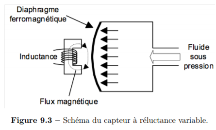

Cahier de laboratoire - GPH2003 

[TOC]


## LABVIEW

***date***: 25 janvier 2019
***coéquipiers***: Anais Parrot & Myryk Gaudreault
***But:*** Reconstruire un signal périodique avec l'acquisition de LABVIEW et comprendre les implications du théorème de Nyquist-Shannon.

### Préparation

- Langage de programmation **G** .
- Interpolation utilisée entre les données échantillonnées: *Polynomiale* & *Trigonométrique*
- Théorème de Nyquist indique que la fréquence échantillonnage doit être au moins 2 fois plus grande que la fréquence du signal mesuré.

#### But: Reconstruire un signal périodique avec LabVIEW & Nyquist

1.2.1 - Acquisition basique d'un signal

1. Générer une fréquence de 100Hz, amplitude 5V.
2. Brancher *NIDAQ > USB* & *Signal > AI0*.
3. Ouvrir un *VI* et suivre infos dans le protocole pour prendre la mesure.
4. La figure 1.2 montre comment créer un tableau avec des valeurs de temps. Premièrement le tableau est créé, ensuite, il est rempli, puis les valeurs sont divisées par la fréquence d'échantillonnage.
5. Tracer les graphiques

1.2.2 - Paramétrisation

1.2.3 - Reconstruction

1.2.4 - Effet de la fréquence

#### Stratégie du laboratoire:

1. Comprendre comment faire une acquisition sous labVIEW et paramétriser une interface.
2. Reconstruire le signal dans un graphique. Vérifier les différentes stratégies d'interpolation de données. Comparer et utiliser celle qui semble la meilleure pour de données périodiques.
3. Prendre différentes acquisitions de données à différentes fréquences, *sous*, *sur* et *au-dessus* de la fréquence de Nyquist de 2.5*Hz* afin d'étudier l'effet de différentes fréquences échantillonnage.
4. Comparer les résultats avec les deux types d'interpolation et discuter des résultats.


### Séance

Schéma fonctionnel du montage:


Le labVIEW est débuté. Familiarisation grossière avec LabVIEW:

- Clic droit dans le diagramme permet de choisir différentes fonctions afin de faire notre instrument virtuel. 
- La construction de tableau se fait en 2 étapes. On doit initialiser le tableau, puis le remplir à l'aide d'une *Boucle* et de la fonction *Remplacer élément*.
- Entrée d'un tableau dans une boucle doit passer dans un registre à décalage.

La création du VI a été faite selon le protocole:


Un échantillonnage sans entrée a été effectué afin d'observer les variations d'incrémentation du signal du bruit. On voit que les valeurs oscillent à coups de *0.002467+0.000087=.* Cette incrémentation  montre effectivement la résolution pour un VI programmé sur une plage de -5 à 5V. Ainsi, sachant que la carte est programmée sur 12 bits, on pourrait trouver la résolution numérique du signal mesuré en faisant $\frac{10}{4096}=0.00244$ V


Ensuite, un échantillonnage du signal sinusoidal a été effectué. 
**Paramètres du sinus:** F = 100Hz, CC = 10V
**Paramètres du VI:** Fréquence d'échantillonnage = 1000Hz, Nombre de mesures = 100, Plage = [-5,5], Résolution = 0.00244

Image de la capture Test:


Afin d'effectuer des mesures et de faire de l'interpolation trigonométrique et polynomiale, un Nouveau VI a été construit afin d'avoir ces nouvelles fonctions:


#### Acquisition des données

Tableaux des fichiers utilisés

Les valeurs constantes sont N=10, F=100 et Résolution Interpolation=1000

**Dans les fichiers:**

Colonne 1 = temps absolu
Colonne 2 = temps de mesure
Colonne 3 = Tension
Colonne 4 = polynomial
Colonne 5 = Fourier

| Description           | Fréquence [Hz] |
| --------------------- | -------------- |
| Mesure test du sinus  | 1000           |
| nyquist_data_1000.csv | 1000           |
| nyquist_data_750.csv  | 750            |
| nyquist_data_500.csv  | 500            |
| nyquist_data_400.csv  | 400            |
| nyquist_data_300.csv  | 300            |
| nyquist_data_200.csv  | 200            |
| nyquist_data_100.csv  | 100            |
| nyquist_data_90.csv   | 90             |
| nyquist_data_60.csv   | 60             |
| nyquist_data_30.csv   | 30             |
| nyquist_data_20.csv   | 20             |
| LOGICIEL PLANTE       | 5              |
| LOGICIEL PLANTE       | 2              |

 

> **Si l'analyse est effectuée:**
>
> Une reconstruction du signal de base de 100Hz sera tenté pour les différentes fréquences d'acquisition. Le théorème de Nyquist sera vérifié à travers l'analyse des résultats.  Selon la théorie, la fréquence minimale afin de reconstruire le signal devrait être de de 200Hz. Idéalement, 1kHz serait la fréquence à privilégier.


## Capteur de Courant

***date***: 1 février 2019
***coéquipiers***: Anais Parrot & Jordan Bourgault
***but***:comparer deux types de capteurs de courant: résistifs et à effet Hall

### Préparation

#### Les caractéristiques majeures d'un capteur sont souvent

- Étendue (plage) sur laquelle la mesure est valable
- Linéarité du capteur. Est-ce que la réponse du capteur est directement proportionnelle au signal physique mesuré?
- Réponse fréquentielle (rapidité de la réactivité du capteur)
- Résolution (plus petite variation mesurable)
- Sensibilité (gain du capteur, petite variation physique=grande variation signal)

#### Types de capteurs de courant

- Shunt: Résistance connue parcourue par un courant et mesure à ses bornes. Résistance faible pour ne pas influencer la mesure, $\Delta V$ détectable, tolérance élevée.
- Hall: Le champ magnétique produit par le passage du courant dans un fil fait dévier la trajectoire d'électrons et créé une différence de potentiel aux bornes du capteur à cause de cette variation de densité électronique de par et d'autre du capteur. Une gaine coaxiale ne permet pas une mesure par effet hall (faraday effet)

#### Manipulations

##### Shunt

1. Faire le circuit du protocole. Calculer la valeur nécessaire de la résistance ainsi que sa tolérance en puissance


1. Faire varier la tension source jusqu'aux limites de la source/tolérance avec des incréments faibles afin d'avoir une bonne résolution. Mesurer la tension aux bornes de RShunt.
2. Mesurer la résistance totale du circuit avec précision et trouvez le courant en fonction de la tension.
3. Comparer la méthode au point 2 et 4

##### Hall 

### Séance

#### Shunt

0.05V = 0.14A

La résistance $R_{shunt}$ est beaucoup trop faible pour être mesurée, la résistance des fils est prédominante. Ainsi, on se fie à la datasheet qui dit:

$R_{shunt}=(0.01000\pm0.00003)\Omega$ 

cette mesure est vérifiée grossièrement en passant un courant dans la résistance, tel qu'il y a une différence de potentiel au borne de la résistance de 10mV. Le courant traversant est alors de 0.1A, ce qui est équivalent à 0.01 Ohms. Cependant, l'incertitude sur la datasheet est plus précise que celle de l'instrumentation utilisée, elle sera donc utilisée.

La résistance totale du circuit est mesurée à l'aide d'un multimètre numérique **Agilent - 34461A**

$R_{circuit}=(2.3\pm0.5)\Omega$, $P_{max}=(5\pm )W$

MAX ampérage circuit = 1.5A, donc on se limite à 1A juste par sécurité. ($P = RI^2\rightarrow \sqrt{\frac{P}{R}}=\sqrt{\frac{5}{2.3}}=1.47A$)

La limitation de la source [**Agilent - U8031A** ]:https://www.keysight.com/en/pd-2054544-pn-U8031A/triple-output-dc-power-supply-30v-6a-2x-375w?nid=-35489.995979.00&cc=CA&lc=eng

est mise à 1A, alors que la tension sera variée jusqu'à l'atteinte de la limite de 1A. Les bons effectués seront de 0.05, ou de 0.1 s'il n'y a pas assez de changement.  

Les branchement initiaux n'étaient pas bon, le courant était envoyé par les branchement où l'on devait prendre la tension aux bornes de RSHUNT et la tension mesurée était aux bornes des fils, donc la résistance était beaucoup trop importante, ainsi que le voltage drop. Le montage a été recommencé et la prise de donnée également.

Il est possible de retrouver le courant du circuit en effectuant le calcul $\Delta V_{shunt}/R_{shunt} = I$

| Tension source [V$\pm$0.02] | Courant calculé dans $R_{shunt}$ [mA$\pm​$0.3] | Courant Calculé avec $R_{total}$[A$\pm​$0] | Courant sur la source [A$\pm$0.02] |
| --------------------------- | --------------------------------------------- | ----------------------------------------- | ---------------------------------- |
| 0.05                        | 19.4$ \pm 0.1$                                | 0.02$\pm$0.01                             | 0.02                               |
| 0.1                         | 41.5$\pm0.2$                                  | 0.04$\pm$0.02                             | 0.04                               |
| 0.15                        | 63.3$\pm0.2$                                  | 0.07$\pm$0.02                             | 0.06                               |
| .20                         | 85.4$\pm0.3$                                  | 0.09$\pm$0.03                             | 0.09                               |
| .25                         | 107.4$\pm 0.3$                                | 0.11$\pm$0.03                             | 0.11                               |
| .3                          | 129.8$\pm 0.4$                                | 0.13$\pm$0.03                             | 0.13                               |
| .35                         | 151.9$\pm 0.5$                                | 0.15$\pm$0.04                             | 0.15                               |
| .4                          | 173.8$\pm 0.6$                                | 0.17$\pm$0.04                             | 0.17                               |
| .45                         | 195.8$\pm 0.7$                                | 0.20$\pm$0.05                             | 0.2                                |
| .50                         | 217.2$\pm 0.8$                                | 0.22$\pm$0.05                             | .22                                |
| .60                         | 261.4$\pm 0.9$                                | 0.26$\pm$0.06                             | 0.26                               |
| .70                         | 305$\pm1$                                     | 0.30$\pm$0.07                             | 0.31                               |
| .80                         | 349$\pm 2$                                    | 0.35$\pm$0.08                             | 0.35                               |
| .90                         | 392$\pm2$                                     | 0.39$\pm$0.09                             | 0.39                               |
| 1.00                        | 436$\pm2$                                     | 0.4$\pm$0.1                               | 0.44                               |
| 1.10                        | 479$\pm2$                                     | 0.5$\pm$0.1                               | 0.48                               |
| 1.20                        | 523$\pm2$                                     | 0.5$\pm$0.2                               | 0.52                               |
| 1.30                        | 570$\pm2$                                     | 0.6$\pm$0.2                               | 0.57                               |
| 1.40                        | 613$\pm2$                                     | 0.6$\pm$0.2                               | 0.61                               |
| 1.50                        | 651$\pm2$                                     | 0.6$\pm$0.2                               | 0.65                               |
| 1.60                        | 699$\pm2$                                     | 0.7$\pm$0.2                               | 0.7                                |
| 1.70                        | 741$\pm3$                                     | 0.7$\pm$0.2                               | 0.74                               |
| 1.80                        | 783$\pm 3$                                    | 0.8$\pm$0.2                               | 0.78                               |
| 1.90                        | 825 $\pm3$                                    | 0.8$\pm$0.2                               | 0.83                               |
| 2.00                        | 866 $\pm 3$                                   | 0.9$\pm$0.2                               | 0.87                               |
| 2.20                        | 940$\pm 6$                                    | 1.0$\pm$0.3                               | 0.94                               |
| 2.40                        | 1020$\pm10$                                   | 1.0$\pm$0.3                               | 1.02                               |
| 2.60                        | 1100$\pm 10$                                  | 1.1$\pm$0.3                               | 1.10                               |

l'incertitude grandissante à partir de 2.2 est due aux variations qui se voyaient surement à cause du réchauffement du circuit à cause du courant qui le traversait.

Graphique sommaire du calcul des courants selon la tension de RShunt. Graphique sommaire du calcul des courants selon la tension de Rtotal


#### Hall

Construire circuit d'alimentation pour alimenter capteur Hall.

1. Monter le circuit à 4.3
2. Choisir un résistance R (Rtotal remesuré avec les connections =2.87+-0.05 )
3. Garder les mêmes résistances sur le circuit de shunt et mettre de la sur le capteur à effet hall. Prendre les mesures en incrémentant la tension de la même manière qu'avec le shunt afin de tracer la courbe d'étalonnage. le courant passant dans le capteur est de 16.990mA +- 0.1

OFFSET 6.4527$\pm$0.008 

Incertitude l'appareil:

Des bons de 0.2V ont étés fait, car les bons de 0.1 prenaient trop de temps.

| Tension Source [V$\pm$0.02] | Tension de Hall [V$\pm$0.008] | Tension de Hall décalée [V$\pm$0.008] | Courant source [mA $\pm$ 20] |
| --------------------------- | ----------------------------- | ------------------------------------- | ---------------------------- |
| 0.10                        | 6.4510                        | 0.0017                                | 40                           |
| 0.20                        | 6.4492                        | 0.0035                                | 70                           |
| 0.30                        | 6.4472                        | 0.0055                                | 90                           |
| 0.50                        | 6.4436                        | 0.0091                                | 180                          |
| 0.70                        | 6.4400                        | 0.0127                                | 250                          |
| 0.90                        | 6.4360                        | 0.0167                                | 320                          |
| 1.10                        | 6.4323                        | 0.0204                                | 400                          |
| 1.30                        | 6.4288                        | 0.0239                                | 470                          |
| 1.50                        | 6.4251                        | 0.0276                                | 540                          |
| 1.70                        | 6.4216                        | 0.0311                                | 610                          |
| 1.90                        | 6.4179                        | 0.0348                                | 680                          |
| 2.00                        | 6.4167                        | 0.0360                                | 710                          |
| 2.20                        | 6.4127                        | 0.0400                                | 780                          |
| 2.40                        | 6.4094                        | 0.0433                                | 840                          |
| 2.60                        | 6.4063                        | 0.0464                                | 910                          |

Mesures pour le décalage de la tension Hall selon le courant d'alimentation du capteur.

| Courant source [mA $\pm$ 20] | Tension de Hall décalée [mV] |
| ---------------------------- | ---------------------------- |
| 40                           | 1.7 $\pm$ 8                  |
| 70                           | 3.5                          |
| 90                           | 5.5                          |
| 180                          | 9.1                          |
| 250                          | 12.7                         |
| 320                          | 16.7                         |
| 400                          | 20.4                         |
| 470                          | 23.9                         |
| 540                          | 27.6                         |
| 610                          | 31.1                         |
| 680                          | 34.8                         |
| 710                          | 36.0                         |
| 780                          | 40.0                         |
| 840                          | 43.3                         |
| 910                          | 46.4                         |

Cependant, les incertitudes sur les mesures de linéarité ne sont pas importantes. On s'intéresse seulement à la relation et non pas au offset. Si l'appareil a une incertitude absolue sur sa mesure, elle sera caractérisée sur l'offset mesuré au départ. La courbe aura donc un offset avec une incertitude de 0.008, mais la linéarité de la relation ne sera pas affectée par cette erreur, mais par l'erreur aléatoire de l'appareil qui peut être négligé, selon la fiche des spécifications du Agilent 34461A.

Des grandes variations avaient étés observée à cause des vibrations sur la table. Celles-ci jouaient probablement sur les contacts des connections, augmentant ainsi la résistance du circuit. Cela a essayé d'être minimisé. Les mesures ont été refaites avec une attention particulière pour les vibrations.

Puissance dissipé pour le capteur à effet hall:

Alimentation de l'opamp 15V*0.01A + Alimentation du capteur 6.00V*0.03A

=0.3 W constant sur toute la plage


##### L'angle influence-t-il la mesure?

De combien approximativement?
Angle vs Tension

Le courant du circuit a été setté à 1A constant (2.86V) au borne du circuit.

à 90, 6.406

à 45 6.39

à 60 6.29

Ça diminue pcq la projection perpendiculaire est plus petite que quand il est à 90, soit totalement perpendiculaire


##### Le courant d'alimentation du capteur influence-t-il les mesure?

Oui, le courant étant augmenté, le champ magnétique est plus intense. Un champ magnétique plus grand traversant un courant similaire engendrera un un déplacement des électrons plus grand à cause de la force de Lorentz plus élevée et donc une tension plus grande.

Une augmentation de 0.2V génère environ la même variation de tension aux bornes du capteur.


**Mesure de la variation en fréquence**

***Capteur HALL***

un générateur de fréquence a été envoyé dans le fil parcourant le capteur a effet Hall. Cette fréquence a été augmentée jusqu'à ce que le signal du capteur commence à varier étrangement.

Fréquence de coupure = 12kHz

***Capteur SHUNT***

même chose fréquence de coupure =30kHz


## Capteur de Position Linéaire

***date***: 8 février 2019
***coéquipiers***: Anais Parrot & Myryk Gaudreault

***But:*** Comparer deux types de capteurs de position linéaire, le potentiomètre et le LVDT.

### Préparation

Types de capteurs de position:

- Potentiomètre linéaire
- LVDT (linear variable differential transfomer)

On utilise un voltmètre au lieu d'un ohmètre afin de me pas tenir compte de la résistance des fils et être plus précis

#### Résistif linéaire

Le déplacement sur un capteur potentiomètre a une relation linéaire entre la résistance du pot et la position du capteur. Il est donc facile de trouver un relation, puisque la variation de la tension de sortie sera directement proportionnelle à la tension entrée, selon une constante.

#### LVDT

On doit faire passer un courant alternatif dans la bobine afin de créer un champ magnétique variable. L'augmentation de tension dépend du couplage  du noyau ferromagnétique. La position du noyau dépend de la position du coeur ferromagnétique. On mesure la différence de tension entre la tension V2 et V3 qui présente la différence de couplage magnétique entre la bobine secondaire 1 et la bobine secondaire 2.

Faible fréquence d'excitation = faible décalage = meilleur car position 0

Tension résiduelle peut être traitée à l'aide d'un détecteur synchrone.


### Séance

#### Plan des manipulations

#####  LVDT position.

Une tension alternative sera appliquée. la fréquence de la source sera appliquée afin de minimiser la tension résiduelle au zéro (origine) où V3-V2=0. Ainsi on trouve la position ou le V3-V2 est un minimale, puis on joue sur la fréquence. des bons de 5mm en position seront effectués, suivi d'une mesure de V3-V2.

Tension utilisée: 2Vpp = 1.41VRMS sinusoide. (2.05V$\pm$0.05)

Fréquence utilisée: Par tâtonnements, une fréquence optimale de 3,016kHz afin de minimiser le déphase, minimiser le zéro résiduel (16mV C-C // 0mV moyenne)

Le couplage moyen à 0 fait que la tension V3-V2 = 0

Mesures position

| Position [ mm$\pm$0.5 ] | V3-V2(C-C)[mV $\pm$ 30] |
| ----------------------- | ----------------------- |
| 15.0                    | 590                     |
| 20.0                    | 640                     |
| 25.0                    | 620                     |
| 30.0                    | 520                     |
| 35.0                    | 380                     |
| 37.0                    | 340                     |
| 39.0                    | 240                     |
| 40.0                    | 140                     |
| 41.0                    | 100                     |
| 42.0                    | 58                      |
| 43.0                    | 20                      |
| 44.0                    | 38                      |
| 45.0                    | 76                      |
| 47.0                    | 158                     |
| 49.0                    | 226                     |
| 52.0                    | 332                     |
| 55.0                    | 422                     |
| 60.0                    | 540                     |
| 65.0                    | 600                     |
| 70.0                    | 580                     |

```markdown
| Distance absolue [mm $\pm$ 0.5] | V3-V2 [mV $\pm$ 20] |
| ------------------------------- | ------------------ |
| 35.0                              | 320                |
| 36.0                             | 292                |
| 37.0                              | 260                |
| 38.0                              | 220                |
| 39.0                              | 184                |
| 40.0                              | 144                |
| 41.0                              | 108                |
| 42.0                              | 64                 |
| 43.0                              | 30                 |
| 44.0                              | 40                 |
| 45.0                              | 80                 |
| 46.0                              | 120                |
| 47.0                              | 160                |
| 48.0                              | 192                |
| 52.0                            | 332                |
| 55.0                            | 422                |
```


##### LVDT angulaire

la position 0 est l'angle 0. On bougera la vis pour trouver ce 0, puis la fréquence utilisée servira à minimiser la tension résiduelle.

Fréquence utilisée = 32.18kHz (minimiser la tension résiduelle et tout)

tension Vpp = 2.77V

longueur de la plaque horizontale 46.5 $\pm$ 0.5 cm

longueur de la tige verticale: 45 $\pm$ 0.5 cm

On utilisera des bons de 0.500mm

côté positif

| Hauteur [mm $\pm$0.005] | V3-V2 [mV $\pm$ 10 ] |
| ----------------------- | -------------------- |
| 14.425                  | 40                   |
| 15.000                  | 70                   |
| 15.500                  | 120                  |
| 16.000                  | 170                  |
| 16.500                  | 250                  |
| 17.000                  | 300                  |
| 17.500                  | 370                  |
| 18.000                  | 430                  |
| 18.200                  | 460                  |

côté négatif

| Hauteur [mm 0.005] | V3-V2 [mV  10 ] |
| ------------------ | --------------- |
| 14.000             | 40              |
| 13.500             | 70              |
| 13.000             | 120             |
| 12.500             | 170             |
| 12.000             | 250             |
| 11.500             | 300             |
| 11.000             | 370             |
| 10.500             | 430             |
| 10.000             | 460             |

## Conditionnement

***date***: 15 février 2019
***coéquipiers***: Anais Parrot & Ludovick Bégin & Hubert Audet

***But:*** Le but de ce laboratoire est de se familiariser avec les différentes options afin de transmettre un
signal sur une longue distance.

### Préparation

On doit traiter un signal afin de s'assurer que sa propagation est efficace. IL peut y avoir des tensions parasites , du bruit, qui vient influencer la propagation sur des grandes distances.

- Sans conditionnement ( perte de potentiel et bruit)
- conversion tension-courant ( pas d'influence du bruit sur le courant) (unidirecitonnel)
  - Le récepteur est seulement un résistance et on mesure variations potentiel aux bornes
- conversion tension-fréquence
  - modulation de la fréquence , immunisé des parasites, come le bruit n'a pas d'influence sur la fréquence
- Conversion par multiplexage
  - Le signal de multiples capteurs est envoyé sur une seule ligne de transmission et une seule de réception
- Conversion Multiplexage dans le temps


### Séance

#### Boucle de courant


Vérifier la variation de courant en fonction de la tension (15 valeurs) et montrer la linéarité

**LINÉARITÉ DU CAPTEUR**

*Tension source signal: 0-5V*

*Tension alimentation: 25.0$\pm$0*.1

| Tension signal [V $\pm$ 0.05] | Courant [mA $\pm$ 0.05] |
| ----------------------------- | ----------------------- |
| 0.00                          | 5.38                    |
| 0.51                          | 7.17                    |
| 0.97                          | 8.50                    |
| 1.48                          | 10.10                   |
| 2.04                          | 11.62                   |
| 2.60                          | 13.10                   |
| 2.93                          | 14.21                   |
| 3.52                          | 15.90                   |
| 3.90                          | 17.04                   |
| 4.49                          | 18.74                   |
| 4.98                          | 20.10                   |


- Observer les variation en fonctions des variation de la source d'alimentation (0-30V) par incrément de 2V avec une tension de signal de (2.50 $\pm$ 0.05)V.

**INFLUENCE DE LA SOURCE**

| Tension alimentation [V $\pm$ 0.02] | Courant mesuré [mA $\pm$ 0.01] |
| ----------------------------------- | ------------------------------ |
| 0.00                                | 0.00                           |
| 1.99                                | 0.03                           |
| 3.00                                | 0.24                           |
| 4.03                                | 5.31                           |
| 3.41                                | 2.21                           |
| 6.01                                | 10.85 $\pm$ 0.04               |
| 8.00 $\pm$ 0.03                     | 12.68                          |
| 9.97                                | 12.77                          |
| 11.99                               | 12.81                          |
| 15.01                               | 12.87                          |
| 25.1 $\pm$ 0.1                      | 13.08 $\pm$ 0.02               |
| 30.0 $\pm$ 0.1                      | 13.10                          |
| 20.0 $\pm$ 0.1                      | 12.92                          |
| 5.04                                | 9.57                           |


!On remarque que la tension d'opération est minimalement de 8V. On remarqu également que la source de tension a une influence sur la résistance maximale que le circuit peut avoir avant d'être influencée.


- On met une résistance variable avec une tension nominale et on observe la variation. du courant.

**INFLUENCE DE LA RÉSISTANCE**

| Résistance utilisée [$\Omega$ $\pm$ 10%] | Courant mesuré [mA $\pm$ 0.05] |
| ---------------------------------------- | ------------------------------ |
| 0                                        | 12.97                          |
| 100                                      | 12.94                          |
| 500                                      | 12.88                          |
| 1000                                     | 12.66                          |
| 2000                                     | 9.75                           |
| 3000                                     | 6.76                           |
| 4000                                     | 5.15                           |
| 5000                                     | 4.15                           |
| 10000                                    | 2.12                           |
| 20000                                    | 1.07                           |

On devrait s'attendre à une transmission constante peu importe la résistance de transmission. On remarque évidemment que la source n,est pas capable de fournir pour des résistance de plus de 1000Ohms. Le commence à diminuer considérablement.

- La mesure que vous venez de faire confirme-t-elle celle que vous avez faite dans la deuxième partie?	

  > Avec les mesures de la deuxieme partie, on remarque que le point d'opération est d'environ 8V. Ayant mise la source à 25V, on devrait pouvoir se permettre un $\Delta V$ d'environ 17V avant d'atteindre ce point d'opération. Si on calcule cela, disons que l'opération normale est à 13mA, une chute de 17 correspondrait à  $\frac{17}{0.013}=1307\Omega$.Comme observé, la résistance de coupure se trouve dans les environs de la résistance calculée.

- Si vous aviez à installer une boucle de courant pour la plage normale de 4 mA à 20 mA, quelle serait la résistance maximale utilisable avec une source d’alimentation de 30 V?

  >La résistance maximale acceptable serait 1100$\Omega$, car on aurait 22Volts de jeu et un courant maximal de 20mA. Ainsi, une résistance de 1100 engendrerait 22V de déscente avec 20mA.

  

#### Multiplexage fréquence

*Vérifier selon le protocol*

- ajuster à 0 la sortie des DEMUX pour entrée de 0
- faire une mesure de la fréquence selon la tension (vérifier la linéarité)
- Tester la linéarité du DEMUX
- Faire un test de bande passante en faissant varier la fréquence d'entrée
- Faire un test  du MUX en appuyant sur les 3 signaux simultanément,


##### Mesure de la modulation en fréquence en fonction de la tension d'entrée:

| Tension signal [V $\pm$ 0.05] | Fréquence [kHz $\pm$ 0.01] |
| ----------------------------- | -------------------------- |
| 0.00                          | 10.00                      |
| 0.52                          | 10.07                      |
| 0.97                          | 10.14                      |
| 1.51                          | 10.21                      |
| 2.00                          | 10.28                      |
| 2.45                          | 10.34                      |
| 3.01                          | 10.43                      |
| 3.49                          | 10.50                      |
| 3.97                          | 10.56                      |
| 4.47                          | 10.64                      |
| 4.95                          | 10.71                      |

- L'amplitude du signal Vpp est de 1.40V


##### Mesure de la démodulation du DEMUX en fonction de la fréquence du signal d'entrée:

- On testera la linéarité du capteur en faisant varier la fréquence de la tension d'entrée dans la plage du filtre passe bande du démux. 

| Fréquence générée [KHz $\pm$ 0.01] | Tension [V $\pm$ 0.01] |
| ---------------------------------- | ---------------------- |
| 9.50                               | 3.43                   |
| 9.60                               | 2.75                   |
| 9.70                               | 2.05                   |
| 9.80                               | 1.35                   |
| 9.90                               | 0.64                   |
| 10.00                              | -0.05                  |
| 10.10                              | -0.75                  |
| 10.20                              | -1.46                  |
| 10.30                              | -2.17                  |
| 10.40                              | -2.88                  |
| 10.50                              | -3.59                  |

##### Mesure de la linéarité de la transmission du signal (modulation et démodulation):

| Tension d'entrée [V $\pm$ 0.01] | Tension [V $\pm$ 0.01] |
| ------------------------------- | ---------------------- |
| 0.00                            | 0.00                   |
| 0.45                            | 0.47                   |
| 1.00                            | 1.03                   |
| 1.99                            | 2.04                   |
| 2.47                            | 2.54                   |
| 3.01                            | 3.09                   |
| 3.51                            | 3.60                   |
| 4.05                            | 4.17                   |
| 4.45                            | 4.57                   |
| 4.88                            | 5.01                   |

Test de la bande passante du modulateur 

- Tension de référence 1.76V
- Signal à 0.707 (1.24V) sera la fréquence de coupure.-3db
- La fréquence de coupure de modulation du signal est 800Hz.

| Canal       | Amplitude d'entrée [V $\pm$ 0.05] | Fréquence d'entrée [Hz $\pm$ 0.5] | Amplitude sortie [V $\pm$ 0.05] | Fréquence de sortie [Hz $\pm$ 0.5] |
| ----------- | --------------------------------- | --------------------------------- | ------------------------------- | ---------------------------------- |
| 1 (10kHz)   | 1.68                              | 100.0                             | 1.76                            | 100.0                              |
| 2 (15kHz)   | 3.14                              | DC                                | 2.94                            | DC                                 |
| 3 (22.5kHz) | 3.99                              | DC                                | 4.09                            | DC                                 |

La linéarité a été observée pour tous les appareils. Le convertisseur de tension-courant permet une transmission de données linéaire. Le multiplexeur permet l'envoi de plusieurs signaux et leur démultiplexage. avec un gain environ unitaire. 

## Amplification d'instrumentation

***date***: 22 février 2019
***coéquipiers***: Ludovick Bégin

***But:***Le but de ce laboratoire est, d’une part, d’étudier le fonctionnement d’un amplificateur d’instrumentation et, d’autre part, d’en concevoir et construire un modèle qui respecte une liste de critères* *préétablis[1].*

[1]  [Protocole](https://sitescours.monportail.ulaval.ca/contenu/sitescours/036/03613/201901/site103274/accueil/bloctexte545794/ressourcestexte/NotesDeCours%20GPH-2003.pdf?identifiant=1d53dc8887cf78038c83287e866aaea46c688607) [p.17].

### Préparation

##### *1. Amplificateur opérationnel*

- Très grande impédance d'entrée, grand gain, faible impédance de sortie.
- Comparateur 
- Gain : $$V_{out} = G_d(V_{in+} - V_{in-})$$
- Généralement gain très grand

##### *2. Suiveur de tension*

- Vin = Vout
- Reproduit la tension à Vin sans l'affecter. 
- Vin doit être entre Vcc+ et Vcc-

##### *3. Amplificateur différentiel*

- Permet de connaître la différence de potentiel entre deux points d'un circuit, tout en l'amplifiant selon les besoins. 
- Gain fixé par les valeurs des résistances utilisées: $$G_d = \frac{R_2}{R_1}$$

##### *4. Gain en mode commun*

- Partie du gain qui dépend de la moyenne des deux potentiels d'entrée. 

- Le taux de réjection du mode commun: $$ TRMC = \frac{G_d}{G_{mc}}$$

##### *5. Amplificateur d'instrumentation*

- Circuit différentiel qui diminue les imperfections
- Équation du gain: $G_D = \left( 1 + \frac{2R_1}{R_4}\right) \frac{R_3}{R_2} $, dans un monde idéal G_mc = 0 mais jamais le cas
- Pour aider aux manipulations, on ajuste généralement uniquement R4 (avec résistance variable). 

L'ampli utilisé est le UA741. Le PINOUT est illustré ci-contre:


### Manipulation

##### Analyse de l'amplificateur différentiel

On mesure Vout en fonction de Vmoy (V1 + V2)/2 en changeant Vmoy sans modifier deltaV. On effectuera une prise de mesures par incréments de 0.5 V sur la plage d'intérêt.

| Vmoy [V  $\pm$ 0.01] | Vout [V  $\pm$ 0.001] |
| -------------------- | --------------------- |
| 0.50                 | 1.003                 |
| 1.00                 | 1.005                 |
| 1.50                 | 1.007                 |
| 2.00                 | 1.009                 |
| 2.50                 | 1.012                 |
| 3.00                 | 1.015                 |
| 3.50                 | 1.017                 |
| 4.00                 | 1.019                 |
| 4.50                 | 1.020                 |
| 5.00                 | 1.021                 |
| 5.50                 | 1.024                 |

- Gain en mode commun mesuré (pente du graphique) = 0.04


On mesure maintenant Vout en fonction de deltaV. On change deltaV en gardant Vmoy constant. On effectuera des Incréments de 1V sur la plage d'intérêt. On garde une moyenne de 7.5V.

| [mV $\pm$  0.01] | [V  $\pm$ 0.001] |
| ---------------- | ---------------- |
| 0.00             | 0.017            |
| 1.00             | 1.017            |
| 2.00             | 2.02  $\pm$0.01  |
| 3.00             | 3.02$\pm$  0.01  |
| 4.00             | 4.02 $\pm$ 0.01  |
| 5.00             | 5.02 $\pm$ 0.01  |
| 6.00             | 6.03 $\pm$ 0.01  |
| 7.00             | 7.03  $\pm$0.01  |

- Gain différentiel mesuré (pente) = 100


##### Analyse de l'amplificateur d'instrumentation

- Faire le montage de l'amplificateur d'instrumentation (**Figure 4**) avec chaque résistance à 1k$\Omega$
- Déterminer les gains (gain différentiel théorique de 3):

On mesure Vout en fonction de Vmoy (V1 + V2)/2 en changeant Vmoy sans modifier deltaV. Prise de mesures par incréments de 1 V sur la plage d'intérêt.

La source de la tensions a été augmentée à -14V +15V afin de permetre au gain de 3 de sortir une tension sans être limité par la source sur une plus grande plage. 

| [mV  $\pm$ 0.01] | [V $\pm$ 0.01] |
| ---------------- | -------------- |
| 0.50             | 3.02           |
| 1.00             | 3.02           |
| 1.50             | 3.02           |
| 2.00             | 3.02           |
| 2.50             | 3.02           |
| 3.00             | 3.02           |
| 3.50             | 3.02           |
| 4.00             | 3.02           |
| 4.50             | 3.02           |
| 5.00             | 3.02           |

- Gain en mode commun mesuré (pente du graphique) = 0

  

On mesure maintenant Vout en fonction de deltaV. On change deltaV en gardant Vmoy constant

- Incréments de 1V sur la plage d'intérêt. On garde une moyenne de 7.5V.

  | [V $\pm$ 0.01] | [V $\pm$ 0.001]  |
  | -------------- | ---------------- |
  | 0.00           | 0.022            |
  | 0.50           | 1.523            |
  | 1.00           | 3.03  $\pm$0.01  |
  | 1.50           | 4.53$\pm$  0.01  |
  | 2.00           | 6.03 $\pm$ 0.01  |
  | 2.50           | 7.54  $\pm$0.01  |
  | 3.00           | 9.05 $\pm$ 0.01  |
  | 3.50           | 10.54 $\pm$ 0.01 |
  | 4.00           | 12.05$\pm$  0.01 |

- Gain différentiel mesuré (pente) = 3

Problème de graphique, le format d'une lettre ne fonctionne pas.

- En ajoutant une asymétrie à l’endroit approprié, quantifiez l’effet d’une disparité entre
  deux résistances (pour les couples R1, R2 et R3). Quels sont les effets sur Gd et Gmc ?

- On fera varier la résistance de 1k vers 500Ohms. pour tous les tests.

- 3 points différents seront utilisées pour ces mesures.

  - **Test de disparité sur R1:** 

    - On prend 3 points d'intérêt avec deltaV de 1 et moyenne variable entre 1, 3 et 5V. 

    | $V_{moy}$ [V $\pm$ 0.01] | $V_{out}$ [V $\pm$ 0.01] |
    | ------------------------ | ------------------------ |
    | 1.00                     | 2.51                     |
    | 3.00                     | 2.51                     |
    | 5.00                     | 2.51                     |

    - Delta V de 1, 2 et 3V avec moyenne constante à 5V.

    | $\Delta V$ [V $\pm$ 0.01] | $V_{out}$ [V $\pm$ 0.01] |
    | ------------------------- | ------------------------ |
    | 1.00                      | 2.51                     |
    | 2.00                      | 5.02                     |
    | 3.00                      | 7.52                     |

  - **Test de disparité sur R2:** 

    - On prend 3 points d'intérêt avec deltaV de 1 et moyenne variable entre 1, 3 et 5V. 

    | $V_{moy}$ [V $\pm$ 0.01] | $V_{out}$ [V $\pm$ 0.01] |
    | ------------------------ | ------------------------ |
    | 1.00                     | 3.85                     |
    | 3.00                     | 4.52                     |
    | 5.00                     | 5.19                     |

    - Delta V de 1, 2 et 3V avec moyenne constante à 5V.

    | $\Delta V$ [V $\pm$ 0.01] | $V_{out}$ [V $\pm$ 0.01] |
    | ------------------------- | ------------------------ |
    | 1.00                      | 5.19                     |
    | 2.00                      | 8.72 $\pm$ 0.02          |
    | 3.00                      | 12.20                    |

  - **Test de disparité sur R3:** 

    - On prend 3 points d'intérêt avec deltaV de 1 et moyenne variable entre 1, 3 et 5V. 

    | $V_{moy}$ [V $\pm$ 0.01] | $V_{out}$ [V $\pm$ 0.01] |
    | ------------------------ | ------------------------ |
    | 1.00                     | 2.14                     |
    | 3.00                     | 2.64                     |
    | 5.00                     | 3.15                     |

    - Delta V de 1, 2 et 3V avec moyenne constante à 5V.

    | $\Delta V$ [V $\pm$ 0.01] | $V_{out}$ [V $\pm$ 0.01] |
    | ------------------------- | ------------------------ |
    | 1.00                      | 3.15                     |
    | 2.00                      | 5.03                     |
    | 3.00                      | 6.95                     |

  - Après avoir rééquilibré toutes les résistances (pour réobtenir le circuit de la figure 2.6), remplacez la résistance R4 par une résistance variable. Quels sont les effets de sa valeur sur Gd et Gmc ?

    - On prend 3 points d'intérêt avec deltaV de 1 et moyenne variable entre 1, 3 et 5V. 

    | $V_{moy}$ [V $\pm$ 0.01] | $V_{out}$ à 500$\Omega$ [V $\pm$ 0.01] | $V_{out}$ à 1k$\Omega$ [V $\pm$ 0.01] | $V_{out}$ à 2k$\Omega$ [V $\pm$ 0.01] | $V_{out}$ à 5k$\Omega$ [V $\pm$ 0.01] |
    | ------------------------ | -------------------------------------- | ------------------------------------- | ------------------------------------- | ------------------------------------- |
    | 1.00                     | 4.93                                   | 2.98                                  | 2.00                                  | 1.41                                  |
    | 3.00                     | 4.93                                   | 2.98                                  | 2.00                                  | 1.41                                  |
    | 5.00                     | 4.94                                   | 2.99                                  | 2.01                                  | 1.41                                  |

    - Delta V de 1, 2 et 3V avec moyenne constante à 5V.

    | $\Delta V$ [V $\pm$ 0.01] | $V_{out}$ à 500$\Omega$ [V $\pm$ 0.01] | $V_{out}$ à 1k$\Omega$ [V $\pm$ 0.01] | $V_{out}$ à 2k$\Omega$ [V $\pm$ 0.01] | $V_{out}$ à 5k$\Omega$ [V $\pm$ 0.01] |
    | ------------------------- | -------------------------------------- | ------------------------------------- | ------------------------------------- | ------------------------------------- |
    | 1.00                      | 4.94                                   | 2.99                                  | 2.01                                  | 1.41                                  |
    | 2.00                      | 9.88                                   | 5.96                                  | 4.00                                  | 2.81                                  |
    | 3.00                      | sat                                    | 8.94                                  | 6.00                                  | 4.22                                  |

- Quels sont les effets de sa valeur sur Gd et Gmc ?


## Capteur de Température

***date***: 1 mars 2019
***coéquipiers***: Anais Parrot - Étienne Ransford - Quentin Auget

***But:***L’expérience est destinée à illustrer et à comparer l’étalonnage et la réponse dynamique 2 de différents
capteurs de température

### Préparation

Types de capteurs étudiés

- Résistance métallique
  - Résistance pure variant avec la température dont le comportement peut être parfaitement modélisé (cristal pure) $$R=\frac{V}{I}$$ avec un R(T) connu.
  - On doit prendre en compte la résistance des fils. Si il est possible de négliger les fils, On utilise directement l'ohmètre. Si on ne peut pas négliger on mesure comme ceci:
  - 
  - La relation obtenue devrait être environ linéaire. Si on doit tenir en compte la courbe de la pente, on peut utiliser deux méthodes: mesurer et hardcoder une table des valeurs dans un ordinateur qui associe une mesure à une valeur. Ou approximer par une fonction analytique $$R=R_0(1_\alpha T + \beta T^2 + ...)$$
- Thermistance
  - résistance variant énormément avec la température. La relation est hautement non linéaire, mais peut être modélisée analytiquement par la relation de Steinhart-Hart
    $$\frac{1}{T}=A+B\ln|R|+C\ln(|R|^3)$$
  - Les valeurs ABC sont obtenues par étalonnage. Cette équation permet une précision de 0,02 degrés sur une plage de 100 degrés
- Jonction de semi-conducteur
  - Le réchauffement d'un jonction PN modifie la tension seuil de celui-ci à cause de la plus grande tension de dérive. Ainsi, on peut grapher la tension au borne du transistor/diode en fonction de la témpérature, qui sera une relation linéarie.
- Thermocouple
  - Effet seebeck $$V=\alpha T$$
  - Grande plage d'utilisation
  - Sensibilité faible (0.04mV/degré)
  - pas totalement linéaire, le coefficient alpha dépend de la température
  - Les connections forment un thermocouple suppoémentaire qui peut etre annulé en connaissant V généré par le thermicouple cuivre-cuivre.
- Étalonnage
  - Les températures facilement reproductibles en laboratoire pour étalonnage des capteurs sont les suivantes:

- Thermomètre à radiation
  - $$P=\epsilon \sigma T^4$$
  - On doit utiliser un système  optique devant le capteur qui servira à concentrer la la radiation sur le capteur et à déterminer la région sur la laquelle la radiation est mesurée.
  - Pour le système optique, Énerige majoritairement dans l'infrarouge, mais les lentilles classique ne laissent pas passer infrarouge, on doit utiliser des lentille fancy exotiques ou des fentres, mais il y aura une réflection importante.
  - Le détecteur est soit quantique ou thermique .
    Quantique: effet photoélectrique, le photon agit directement (phototransistor, photodiodes,PMT, etc.)
    Thermique: absorbent les photons et on mesure la température. On place une thermopile au centre du foyer d'un mirroir
- Calculs
  - quand tout est à temperature ambiante, on obtenient quand même une puissance mesurée qui provient de la radiation de l'environnement. ainsi, on veut la différence avec la température mesurée et la température ambiante. $$V = c(T_1^4-T_a^4)$$ l'exposant dépend de la thermipile utilisée et la consatnte est trouvée à travers un étalonnage

#### Manipulations

Comparaison de l'étalonnage secondaire sur les différents types de capteurs. Il s'agira de comparer avec avec un capteur préétabli.

On brachera les capteurs sur un acquisitionneur afin de pouvoir effectué l'étalonnage conjointement de plusieurs capteurs

Pour le thermocouple et la résistance platine, on décidera une plage de variation qui monte jusqu'à 200°C. Les thermistances et jonction PN seront soumises jusqu'à 100°C

### Protocol

L'étalonnage des 5 capteurs suivants sera fait simultanément dans un bassin de sable allant de Ta à 200°C:

- Thermocouple non gainé
- Thermocouple gainé
- Résistance de platinium
- Thermistance
- Jonction PN

- Finalement, après plusieurs essais le montage a été changé.  La diode et la thermistance ont été placés dans un bécher contenant de l'eau sur une plaque chauffante. Les Capteurs diode et thermistance ont été mesuré en même temps sur une plage de [T de départ, par bonds de 5, jusqu'à 100°C.].


​				**Tableau 1: Mesure de la dérive de tension du thermocouple** (mesure a été omise)

| Température Ref [°C $\pm$0.01] | Tension mesurée [V $\pm$ 0.001] |
| ------------------------------ | ------------------------------- |
| Amb                            |                                 |
| 25.00                          |                                 |
| 30.00                          |                                 |
| 35.00                          |                                 |
| 40.00                          |                                 |
| 45.00                          |                                 |
| 50.00                          |                                 |
| 55.00                          |                                 |
| ....                           |                                 |

- La Température pour les thermocouples a été prise dans le bac de sable pour des températures de 100 à 200°C

- La température pour les thermocouples a été prise dans l'eau bouillante pour des températures  de Tamb à T=100°C

​				**Tableau 2: Mesure de la dérive de tension du thermocouple gainé** (mesure a été omise)

| Température Ref [°C 0.01] | Tension mesurée [V  0.001] |
| ------------------------- | -------------------------- |
| Amb                       |                            |
| 25.00                     |                            |
| 30.00                     |                            |
| 35.00                     |                            |
| 40.00                     |                            |
| 45.00                     |                            |
| 50.00                     |                            |
| 55.00                     |                            |
| ....                      |                            |

​	

La diode a été alimentée avec un courant de 1mA (0.9861mA $\pm$ 0.001)

​		**Tableau 3 : Mesure de la dérive de la tension de seuil de la diode suite à une variation de courant, lorsque qu'alimenté à courant constant de 1mA.**

| Température Ref [°C 0.01] | Tension mesurée [mV  0.001] |
| ------------------------- | --------------------------- |
| Amb                       |                             |
| 25.00                     |                             |
| 34.0                      | 569.1                       |
| 35.00                     | 566.5                       |
| 40.00                     | 554.4                       |
| 45.00                     | 545.9                       |
| 50.00                     | 534.0                       |
| 55.00                     | 523.6                       |
| 60.0                      | 514.3                       |
| 65.0                      | 502.9                       |
| 70.0                      | 492.1                       |
| 75.0                      | 481.6                       |
| 80.0                      | 470.5                       |
| 85.0                      | 459.9                       |
| 90.0                      | 451.2                       |
| 95.0                      | 437.7                       |
| 99.5                      | 430.4                       |

- Les températures ont été prises dans de l'eau sur une plaque chauffante de Tambiant à 100°C par incréments de 5°C

  

Tableau 1: Mesure de la dérive de la résistance de la thermistance en fonction de la tension

| Température Ref [°C 0.1] | Résistance mesurée [V  0.3] |
| ------------------------ | --------------------------- |
| Amb                      |                             |
| 32.1                     | 178.07                      |
| 35.0                     | 161.1                       |
| 40.0                     | 140.1                       |
| 45.0                     | 123.7                       |
| 50.0                     | 106.7                       |
| 55.0                     | 94.0                        |
| 60.0                     | 83.2 $\pm 0.5$              |
| 65.0                     | 73.3                        |
| 70.0                     | 64.7                        |
| 75.0                     | 57.4                        |
| 80.0                     | 51.1                        |
| 85.0                     | 45.6                        |
| 90.0                     | 41.0                        |
| 95.0                     | 36.3                        |
| 99.7                     | 32.8                        |
| 100.0                    |                             |
|                          |                             |

- Les températures ont été prises dans de l'eau sur une plaque chauffante de Tambiant à 100°C par incréments de 5°C


Pour la mesure du capteur Radiatif, celui-ci a été placé à une distance de 35cm. la plaque chauffante a été branchée puis chauffée jusqu'à une température de 250°C. Les mesures ont été prises  de Tambiant à 250°C. Sur la plage de valeur de 0 à 80°C, les variations étaient à peine perceptibles et les oscillations étaient très grandes. Cela peut-être causé par le fait que la radiation d'arrière plan est facilement perturbable.  


La mesure de la réponse dynamique des thermocouples a été mesuré en plongeant les thermomètres dans de la glace alors qu'il étaient précédemment dans l'eau bouillante. Le régime permanent a été attendu.

Non gainé 11s

gainé 20s

## Capteur de Position Angulaire (Semaine annulée)

### Préparation

### Séance


## Débitmètre

***date***: 8 mars 2019
***coéquipiers***: Anais Parrot - Étienne Ransford - Quentin Auget

***But:***Le but de ce laboratoire est de caractériser deux débimètres, soit un débitmètre à temps de transit
et un débitmètre à déphasage, puis de comparer leurs performances afin de déterminer les avantages
et inconvénients de chacun

### Préparation

Types de capteurs: 

- Débitmètre à turbine
  - Liquides et les gazs
  - Dynamo-miniature-
  - grande précision
- Débitmètre à aubes
  - vitesse de rotation proportionnelle à celle du liquide
  - rotation mesurée électriquement ou optiquement
  - aimant qui tourne avec bobine. Il y aura un V indui
- perturbation thermique
  - chauffe un fil avec impuilsion qui chaufe liquide
  - capteur placé plus loin vient détecter le liquide cahuffé oin peut alors déteerminer la distance qu'elle a parcourue
- Débitmèetre à orifice
  - capteur de pression différentiel qui mesure la différence de pression pour un chabgement de section de tuyau connu. On peut déterminer la vitesse avec les équations de bernouilli
- Débit metre à capteur chauffé
  - ON regarde le RP en chauffant un fil dans le truc
- DÉbitmètre par effet doppler
  - vibrations acoustiques f_1 dans le liquide
- Débitmètre à temps de propagation
  - Ultrasons pulsés en paquet sont propagés, le temps que cela prend dépend directement de la vitesse du fluide, car celui-ci a un composante en cos()
- Débitmètre à déphasage
  - Au lieu d'un 

**Matériel:**

 2 conduites en plexiglas ;
— ventilateur à débit variable ;
— tube de Pitot ;
— jauge de pression ;
— transmetteur et récepteur pour le débitmètre à temps de propagation ;
— transmetteur et récepteur pour le débitmètre à déphasage ;
— oscilloscope ;
— câbles, fils et adaptateurs.

**Manipulations:**

À déterminé durant la période de labo

Angle du capteur: 45$\pm$5

****

### Séance

Débitmètre déphasage


UN variac est branché au ventillateur. Celui-ci est connecté à un tube qui contient le capteur à angle avec un tube de pitot au bout pour déterminer la vitesse du fluide

DImètre du tube: 8.0cm

Longeur du tube pour capteur: 26.0cm

<<<<<<< refs/remotes/origin/hello
| $\Delta P$$\pm$ 4 | $\Delta \phi$ $\pm$ 5                         |
=======
longeur du pulse envoyé: 180ns

| $\Delta P$$\pm​$ 4 | $\Delta \phi$ $\pm​$ 5                         |
>>>>>>> add lab 4
| ----------------- | --------------------------------------------- |
| 0                 | -95 $\pm$ 5                                   |
| 10                | -71$\pm$2                                     |
| 17                | -62 $\pm$1                                    |
| 23                | -57 $\pm$ 1                                   |
| 34                | -50$\pm$0.5                                   |
| 44                | -44$\pm$1                                     |
| 65                | -33                                           |
| 71                | -31                                           |
| 76                | -29                                           |
| 80                | -26                                           |
| 84                | -25                                           |
|                   | $$V=\sqrt{\frac{2(P_{tot}-P_{stat})}{\rho}}$$ |


| Déphasage [$\Delta \phi$ $\pm$ 5] | Vitesse de l'air [$m/s$] |
| --------------------------------- | ------------------------ |
| -95                               | 0.0$\pm$0.5              |
| -71$\pm$2                         | 4.1$\pm$1.4              |
| -62 $\pm$1                        | 5.4$\pm$1.1              |
| -57 $\pm$1                        | 6.2$\pm$0.9              |
| -50$\pm$1                         | 7.6$\pm$0.8              |
| -44$\pm$1                         | 8.6$\pm$0.6              |
| -33                               | 10.5$\pm$0.6             |
| -31                               | 11.0$\pm$0.6             |
| -29                               | 11.3$\pm$0.5             |
| -26                               | 11.6$\pm$0.5             |
| -25                               | 11.9$\pm$0.5             |
|                                   |                          |

À l'aide du tube de Pitot, on mesure la vitesse du fluide avec la formule ci-dessus.

densité de l'air à 25C et 1atm. = 1.1839kg/m3

l'incertitude à été calculée avec les opérations sur l'incertitude.


Débitmètre à temps de transit

DImètre du tube: 8.0cm

Longeur du tube pour capteur: 23.8cm

P-P:308mV

P-P: 7.12

<<<<<<< refs/remotes/origin/hello
| $\Delta P$ $\pm $1 | $\Delta t$$\pm $0.1 |
| ------------------ | ------------------- |
| 0                  | 750.8               |
| 6                  | 748.4               |
| 9                  | 747.6               |
| 14                 | 746.6               |
| 24                 | 746.4               |
| 29                 | 746.0               |
| 43                 | 744.2               |
| 50                 | 744.4               |
| 56                 | 743.6               |
| 62                 | 743.2               |
| 64                 | 743.2               |
|                    |                     |
=======
| Temps de propagation [$\mu s$$\pm $0.1] | $V_{fluide}$[$m/s$] | $\Delta P$[Pascals$\pm $1] |
| --------------------------------------- | ------------------- | -------------------------- |
| 750.8                                   | 0 $\pm$ 2           | 0                          |
| 748.4                                   | 3.2 $\pm$ 1.8       | 6                          |
| 747.6                                   | 3.9 $\pm$ 1.5       | 9                          |
| 746.6                                   | 4.9 $\pm$ 1.2       | 14                         |
| 746.4                                   | 6.4$\pm$ 0.8        | 24                         |
| 746.0                                   | 7.0 $\pm$ 0.8       | 29                         |
| 744.2                                   | 8.5$\pm$0.7         | 43                         |
| 744.4                                   | 9.2$\pm$0.6         | 50                         |
| 743.6                                   | 9.7$\pm$0.6         | 56                         |
| 743.2                                   | 10.2$\pm$0.6        | 62                         |
| 743.2                                   | 10.4$\pm$0.6        | 64                         |
|                                         |                     |                            |
>>>>>>> add lab 4

$$V=\sqrt{\frac{2(P_{tot}-P_{stat})}{\rho}}$$

| Vitesse de l'air [$m/s$] | Délais de propagation [$\mu s$ $\pm$ 0.1] |
| ------------------------ | ----------------------------------------- |
| 0.0 $\pm$ 1.8            | 750.8                                     |
| 3.2 $\pm$ 1.8            | 748.4                                     |
| 3.9 $\pm$ 1.5            | 747.6                                     |
| 4.9 $\pm$ 1.2            | 746.6                                     |
| 6.4 $\pm$ 0.9            | 746.4                                     |
| 7.0$\pm$ 0.9             | 746.0                                     |
| 8.5 $\pm$ 0.7            | 744.2                                     |
| 9.2 $\pm$ 0.7            | 744.4                                     |
| 9.7 $\pm$ 0.6            | 743.6                                     |
| 10.2 $\pm$ 0.6           | 743.2                                     |
| 10.4 $\pm$ 0.6           | 743.2                                     |

À l'aide du tube de Pitot, on mesure la vitesse du fluide avec la formule ci-dessus.


## Capteur de Pression

**Date : ** Conception le 28 Mars et laboratoire le 29 Mars 2019
**Partenaires :** Étienne Ransford, Anais Parrot, Quentin Perry-Auger

**Buts de l'expérience :**

Le but de ce laboratoire est de se familiariser avec différents types de capteurs de pression, de les caractériser. Les capteurs de pression étudiés dans laboratoire sont :

1. un capteur différentiel à réluctance variable ;
2. deux capteurs non différentiels à pression élevée (jauge à déformation et réluctance variable) ;
3. une jauge à vide (thermocouple).

### Préparation

Principe de base : paroi se déforme sous pression et cette déformation est mesurée (jauge à déformation) par diverses méthodes. Les variations doivent être linéaire, donc les déformation doivent être faible afin de rester dans le régime linéaire.

#### Jauge a déformation


Diaphragme transmet sa déformation au levier. Résistances montées en pont de Wheatstone alors déséquilibre

#### Capteurs à réluctance variable

Pression rapproche diaphragme qui augmente inductance. Le diaphragme ferme la boucle de flux magnétique. plus le diaphragme est proche, plus le flux est important et plus l'inductance augmente. Possible d'utiliser face a face pour avoir déplacement du diaphragme proportionnel a P1-P2 (mode différentiel) en comparant L1 et L2. Possible d'utiliser ce setup en pont de Wheatstone en replancant deux des résistances avec les inductances.

Différentiel (Limité a environ 10kPa) : 




#### Capteur potentiomètre

Avantages : peut outputs plusieurs volts et nécessite pas d'ampli. Toutefois, limité par la friction

### Séance

#### Matériel

— 2 montages pour la génération de pressions élevées ;
— capteur de pression à jauge à déformation ;
— microvoltmètre ;
— capteur de pression à réluctance variable ;
— pont pour le capteur à réluctance variable ;
— capteur de pression différentiel à réluctance variable ;
— pont pour le capteur différentiel ;
— jauge à thermocouple ;
— source de courant constant pour la jauge à thermocouple ;
— source de tension (5 V, 10 V, 0–120 mA) ;
— générateur de fonctions ;
— oscilloscope ;
— colonnes d’eau ;
— moniteur de température ;
— pompe à vide DuoSeal 1400 1 
— câbles, fils et adaptateurs.

#### Manipulations

##### Capteur différentiel à reluctance variable

Pour produire les pressions mesurables, des colonnes d'eau seront utilisées.

Phase de 0 : augmentation de L1/ diminution de L2 et phase 180 = inverse

Basse pression (ce qu'il faut pour Capteur différentiel à reluctance variable) : colonnes d'eau
     on peut calculer P avec $P = \rho g h$.

Manipulations de base proposée : signal alternatif AB en fonction de hauteur colonne d'eau

**Étalonnage**

1) enlever les bulles à l'aide de la méthode dans le protocole

2) on branche la sortie a l'oscilloscope (puisque c'est AC et il faut considérer les phases)
Ne pas oublier j'ajuster le pont de wheatstone et de l'alimenter avec 300khz 4V.
Zero du pont : 0.0034 ± 0.0001
4.00 ± 0.01 a 357.7 ±0.1 kHz 

3) on rempli une colonne et on la vide, puis rempli la seconde colonne


**Reluctance variable non-différentiel:**

Faire varier la pression avec des variantions constantes. Ajouter du poids sur les plaques et mesurer la variation de la tension. Balancer le pont de Wheatstone à 0  pour une pression de 0. La pression variante va faire varier la tension. On mesurera cette relation.

Des poids sont ajoutés

Premièrement,  les appareils ont été branchés. 

Le signal generator a été ajusté afin d'avoir un signal d'excitation de 3.68V $\pm$ 0.1V

le pont de Wheatstone a été ajusté afin d'avoir le signal le plus petit à la sortie (pont de Wheatstone ajusté) 

4.5Kg ont été ajoutés


| Pression $\pm$ 5 | Tension au pont [mV $\pm$ 5] |
| ---------------- | ---------------------------- |
| 0                | 28 $\pm$ 5                   |
| 50               | 30 $\pm$ 5                   |
| 100              | 32                           |
| 150              | 38                           |
| 200              | 50                           |
| 250              | 58                           |
| 300              | 70                           |
| 350              | 78                           |
| 400              | 88                           |
| 450              | 98                           |
| 500              | 106                          |
| 550              | 114                          |
| 600              | 124                          |
| 650              | 136                          |
| 700              | 144                          |
| 750              | 152                          |
|                  |                              |


**Colonne d'eau**

Le même principe est utilisé pour le capteur à différentiel. On mesure la différence de pression en les deux colonnes d'eau.  Il s'agit du même pont de wheatstone


PP 4V

Température de la pièce: 242

ON commence à 90cm de hauteur pour les deux colonnes. On enlève progressivement de l'eau dans une colonne afin de générer une différence de pression aux bornes du capteur

| DIfférence du hauteur des colonnes d'eau [mm $\pm$ 1] | Tension au capteur [mV $\pm$ 5] |
| ----------------------------------------------------- | ------------------------------- |
| 0                                                     | 12 $\pm$ 2                      |
| 50                                                    | 14 $\pm$ 2                      |
| 100                                                   | 19 $\pm$ 2                      |
| 150                                                   | 25 $\pm$ 2                      |
| 200                                                   | 30 $\pm$ 2                      |
| 250                                                   | 37 $\pm$  2                     |
| 300                                                   | 43 $\pm$ 2                      |
| 350                                                   | 49 $\pm$ 2                      |
| 400                                                   | 55                              |
| 450                                                   | 61                              |

On peut calculer la pression avec $\rho g h$

Les spécifications du capteurs sont sur les photos prises:


**Jauge déformation non-différentiel**

![1553883958197](assets/1553883958197.pngLe montage est particulièrement similaire au montage pour la reluctance. 

| Pression $\pm$ 10 | Tension au pont de Wheatstone [mV] $\pm 0.05$ |
| ----------------- | --------------------------------------------- |
| 0                 | 0.611 $\pm$ 0.001                             |
| 100               | 2.410 $\pm 0.05$                              |
| 150               | 3.856                                         |
| 200               | 5.643                                         |
| 250               | 6.956                                         |
| 300               | 8.700                                         |
| 350               | 9.850                                         |
| 400               | 11.493                                        |
| 450               | 13.000                                        |
| 500               | 14.317                                        |
| 550               | 15.870                                        |
| 600               | 17.499                                        |
| 700               | 20.425                                        |
| 800               | 23.50                                         |


**Thermocouple**

On allume l'alimentation qui alimente le thermocouple et on note la température tout en faisant varier la pression dans le tube en fonction de la pression.

| pression [mmHg] | Température [°C] $\pm$ 0.5 |
| --------------- | -------------------------- |
| 50              | 340.2                      |
| 10              | 321.2                      |
| 150             | 303.1                      |
| 200             | 286.3                      |
| 250             | 274                        |
| 300             | 264.5                      |
| 350             | 258.0                      |
| 400             | 251.8                      |
| 450             | 246.8                      |
| 500             | 241.6                      |
| 550             | 237.2                      |
| 600             | 232.6                      |
| 650             | 227.7                      |
| 700             | 225.5                      |

$PV=nRT$

modification du $k$ coefficient de conduction (Vérifier si 'K' est dépendant)


Jauge à déformation
---

***date***: 5 Avril 2019
***coéquipiers***: Anais Parrot - Étienne Ransford - Quentin Auget

***But:***Le but de ce laboratoire est d’observer le fonctionnement des jauges à déformation et des circuits
associés, ainsi que de comparer la performance des différents circuits et montages possibles. Plus
spécifiquement, et sans s’y limiter, les objectifs sont :
1. Déduire la déformation d’une poutre en fonction du signal d’une jauge.
2. Déduire la déformation d’une poutre en utilisant deux jauges
3. Quantifier les effets de variation de température avec un pont non compensé (une seule jauge).
4. Quantifier les effets de variation de température avec un pont compensé (deux jauges).
5. Appliquer les notions vues pour mesurer l’augmentation de volume que subit une petite bonbonne de gaz lors de sa mise sous pression.

[1] [Protocole de laboratoire](https://sitescours.monportail.ulaval.ca/contenu/sitescours/036/03613/201901/site103274/accueil/bloctexte545794/ressourcestexte/NotesDeCours%20GPH-2003.pdf?identifiant=1d53dc8887cf78038c83287e866aaea46c688607) [p.51].

### Préparation


​					**Figure 1:** Schéma de la jauge à déformation

La jauge à déformation fonctionne par l'intermédiaire d'un matériau conductif qui suit la déformation d'un matériau d'intérêt. Il suffit alors de mesurer la variation de la résistance de la jauge afin de déterminer la déformation physique. 


**_1. Circuit de mesure_**

- Déformations limités aux domaines d'élasticité des matériaux, soit généralement 0.05 %. 
- Donc faibles variations de résistance demande un pont de Wheatstone. Ceci permet de mesurer la déformation par une différence de tension. 


​		**Figure 2:** Schéma du pont de Wheatstone utilisé pour la jauge à déformation.

- Différence de potentiel calculée ainsi:


- Il faut au moins une résistance variable afin d'équilibrer le pont. Ou plus simplement de suivre la méthode avec pont avec zéro ajustable par l'intermédiaire d'une résistance variable: 


​		**Figure 3:** Schéma du pont de Wheatstone à zéro ajustable utilisé pour la jauge à déformation.

**_2. Calcul de la déformation_**

- Le facteur de Jauge  est calculé à l'aide du coefficient de Poisson qui détermine le ratio de déformation entre les différents axes d'un matériau ou encore par
- 
- Le coefficient de Poisson vaut environ 0.3 pour la plupart des matériaux. On obtient donc
  F.J. = 1.6 . 
- $\rho$ change lorsque la jauge se déforme. On observe FJ = 2 pour des jauges métalliques. 
- 


**_3. Sources d'erreur_**

- La plus grande source d'erreur est la température à cause de dilatation thermique des matériaux qui vient déformer la jauge.
- On peut mettre une jauge sans contrainte (seulement effet de la température) dans le pont de Wheatstone afin de balancer les variations de température.

 

**_4. Exercices préparatoires_**

1. $$dV = V_s(-R_4(R_1 + R_4)^{-2})dR_1$$
2. Avec le facteur de jauge --> $$ F.J \epsilon = \frac{\Delta R}{R}  = 1.6 \epsilon =\frac{dV}{V_s(-R_4(R_1 + R_4)^{-2})}$$
   $$\epsilon =  \frac{dV}{1.6 V_s(-R_4(R_1 + R_4)^{-2})}$$


#### Montage

##### Montage obtenu


​									**Figure 5: ** Montage


### Manipulations

##### Consigne importante

*Afin de ne pas endommager le montage, ne dépassez pas une température de 80 ◦C avec les souffleries*. [1]

##### Cylindre pressurisé

Mesure de la déformation radiale du cylindre pressurisé. FJ = 2.1

- Diamètre de 49.56 $\pm$ 0.05  mm
- Température ambiante
- Jauge connecté au pont de Wheatstone à R1 ainsi qu'une résistance R4 de 120 $\Omega$. R2 et R3 à 100 $\Omega$. 
- Mesure de la tension de sortie pour la jauge à déformation en fonction de la pression interne. 
- - Faire la mise à zéro du pont (équilibre) à 500 kPa
- Pression entre 500 kPa et 7000 kPa par incréments de 500 kPa. 

| Pression [kPa $\pm$ 50] | dV [$mm^3$ $\pm$ 0.02] |
| ----------------------- | ---------------------- |
| 500                     | 0.02                   |
| 1000                    | 0.06                   |
| 1500                    | 0.10                   |
| 2000                    | 0.14                   |
| 2500                    | 0.18                   |
| 3000                    | 0.21                   |
| 3500                    | 0.24                   |
| 4000                    | 0.27                   |
| 4500                    | 0.30                   |
| 5000                    | 0.33                   |
| 5500                    | 0.35                   |

À 6Mpa, jauge de sécurité s'est ouverte. Toute qu'un saut.

 

##### Plaque en tension


Mesure de la déformation linéaire pour un barre en tension

- FJ = 2.0

- Longueur totale L = 24.8 $\pm$ 0.3

- Distance $l$ = 12.6 $\pm$ 0.5

- Épaisseur = 4.26 $\pm$ 0.05

- Ajuster le pont de Wheatstone afin d'avoir une sortie de 0V $\pm$ 0.00002V

- **Premier test avec la jauge du haut seulement**. Mesure de tension de sortie du pont en fonction de la hauteur au support.

- Incréments de 0.5 mm sur une plage de 0 mm à 8 mm.

- | Tension [V  0.02] | calculé         | théorique         | Résistance R1 [  8] | Hauteur [mm  0.01] |
  | ----------------- | --------------- | ----------------- | ------------------- | ------------------ |
  | 0.00              | 0.0000000±0.002 | 0.0±0.000003      | 120                 | 0.00               |
  | 0.08              | 0.0000267±0.002 | 0.000021±0.000003 | 120                 | 0.50               |
  | 0.18              | 0.0000600±0.002 | 0.000042±0.000005 | 120                 | 1.00               |
  | 0.29              | 0.0000967±0.002 | 0.000063±0.000007 | 120                 | 1.50               |
  | 0.36              | 0.0001200±0.002 | 0.000084±0.000009 | 120                 | 2.00               |
  | 0.43              | 0.0001433±0.002 | 0.000104±0.000012 | 120                 | 2.50               |
  | 0.51              | 0.0001700±0.002 | 0.000125±0.000014 | 120                 | 3.00               |
  | 0.59              | 0.0001967±0.002 | 0.000146±0.000016 | 120                 | 3.50               |
  | 0.63              | 0.0002100±0.002 | 0.000167±0.000018 | 120                 | 4.00               |
  | 0.70              | 0.0002333±0.002 | 0.00019±0.00002   | 120                 | 4.50               |

Valeurs organisées pour l'analyse dans python:

| Tension [V $\pm$ 0.02] | $\epsilon $ calculé | $\epsilon $ théorique |
| ---------------------- | ------------------- | --------------------- |
| 0.00                   | 0.0000000±0.002     | 0.0±0.000003          |
| 0.08                   | 0.0000267±0.002     | 0.000021±0.000003     |
| 0.18                   | 0.0000600±0.002     | 0.000042±0.000005     |
| 0.29                   | 0.0000967±0.002     | 0.000063±0.000007     |
| 0.36                   | 0.0001200±0.002     | 0.000084±0.000009     |
| 0.43                   | 0.0001433±0.002     | 0.000104±0.000012     |
| 0.51                   | 0.0001700±0.002     | 0.000125±0.000014     |
| 0.59                   | 0.0001967±0.002     | 0.000146±0.000016     |
| 0.63                   | 0.0002100±0.002     | 0.000167±0.000018     |
| 0.70                   | 0.0002333±0.002     | 0.00019±0.00002       |

| Tension [V  0.02] | calculé         | théorique         | Résistance R1 [  8] | Hauteur [mm  0.01] |
| ----------------- | --------------- | ----------------- | ------------------- | ------------------ |
| 0.00              | 0.0000000±0.002 | 0.0±0.000003      | 120                 | 0.00               |
| 0.08              | 0.0000267±0.002 | 0.000021±0.000003 | 120                 | 0.50               |
| 0.18              | 0.0000600±0.002 | 0.000042±0.000005 | 120                 | 1.00               |
| 0.29              | 0.0000967±0.002 | 0.000063±0.000007 | 120                 | 1.50               |
| 0.36              | 0.0001200±0.002 | 0.000084±0.000009 | 120                 | 2.00               |
| 0.43              | 0.0001433±0.002 | 0.000104±0.000012 | 120                 | 2.50               |
| 0.51              | 0.0001700±0.002 | 0.000125±0.000014 | 120                 | 3.00               |
| 0.59              | 0.0001967±0.002 | 0.000146±0.000016 | 120                 | 3.50               |
| 0.63              | 0.0002100±0.002 | 0.000167±0.000018 | 120                 | 4.00               |
| 0.70              | 0.0002333±0.002 | 0.00019±0.00002   | 120                 | 4.50               |


- Accrochage des fils, fin des mesures car débalancement du pont de Wheatstone.
- **Deuxième test avec les deux jauges** en compensation sur le pont. Mesure de tension de sortie du pont en fonction de la hauteur au support. 
- Incréments de 0.5 mm sur une plage de 2 mm à 8 mm.

| Hauteur au support [mm $\pm$ 0.01] | Tension [mV $\pm$ 0.02] |
| ---------------------------------- | ----------------------- |
| 2.5                                | 0                       |
| 3.0                                | 0.15                    |
| 3.5                                | 0.29                    |
| 4.0                                | 0.42                    |
| 4.5                                | 0.55                    |
| 5.5                                | 0.70                    |
| 6.0                                | 0.84                    |
| 6.5                                | 0.98                    |
| 7.0                                | 1.10                    |

 Pour traitement de données dans python:

| $\epsilon$ $\pm$ 0 | Tension [V  $\pm$ 0.02] |
| ------------------ | ----------------------- |
| 0.0000000±0.002    | 0.00                    |
| 0.0000267±0.002    | 0.15                    |
| 0.0000600±0.002    | 0.29                    |
| 0.0000967±0.002    | 0.42                    |
| 0.0001200±0.002    | 0.55                    |
| 0.0001433±0.002    | 0.70                    |
| 0.0001700±0.002    | 0.84                    |
| 0.0001967±0.002    | 0.98                    |

##### Effet de la température 2 capteurs

- Chaleur générée par la soufflerie. 
- Troisième test avec les deux jauges en compensation sur le pont. Mesure de tension de sortie du pont en fonction de la température. 
- Position fixe (compression constante) à 2.00 mm $\pm$ 0.01
- Mise à zéro à 24 C
- Incréments de X Celsius entre 24 C et Y C. 

| Température [C $\pm$ 1] | Tension [mv] $\pm$ 0.02 |
| ----------------------- | ----------------------- |
| 26                      | 0.0                     |
| 30                      | 0.3                     |
| 33                      | 0.3                     |
| 35                      | 0.6                     |
| 40                      | 1.4                     |
| 43                      | 1.4                     |
| 46                      | 1.6                     |
| 50                      | 1.8                     |
| 54                      | 1.9                     |
| 59                      | 1.9                     |
| 65                      | 2.0                     |
| 69                      | 1.9                     |
|                         |                         |
|                         |                         |

- Test avec la jauge du bas

| Température [C $\pm$ 1] | Tension [mv $\pm$ 0.02] |
| ----------------------- | ----------------------- |
| 30                      | 0.0                     |
| 33                      | 1.0                     |
| 39                      | 3.0                     |
| 42                      | 4.3                     |
| 45                      | 5.7                     |
| 48                      | 6.3                     |
| 52                      | 7.3                     |
| 55                      | 8.0                     |
| 57                      | 8.3                     |

Résistance jauge supérieure: 122.8

Résistance jauge bas: 120.8

Petite résistance 120.6


**note sur les déformations**


