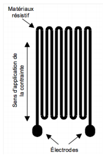
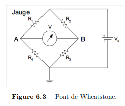
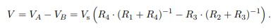
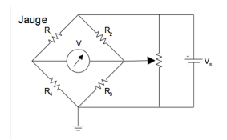
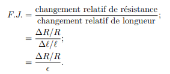
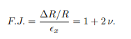
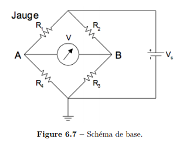
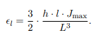
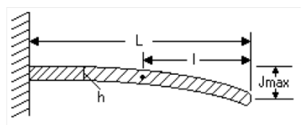

## Jauge à déformation

| **Marc-André Vigneault**                           | Date de préparation: 4 Avril 2019        |
| -------------------------------------------------- | ---------------------------------------- |
| **Coéquipiers:** Anais parrot, Quantin perry-auger | **Date d'expérimentation: 5 Avril 2019** |

[1] Protocole de laboratoire [disponible ici](https://sitescours.monportail.ulaval.ca/contenu/sitescours/036/03613/201901/site103274/accueil/bloctexte545794/ressourcestexte/NotesDeCours%20GPH-2003.pdf?identifiant=1d53dc8887cf78038c83287e866aaea46c688607) [p.51].

### But

*Le but de ce laboratoire est d’observer le fonctionnement des jauges à déformation et des circuits
de mesures, ainsi que de comparer la performance des différents capteurs. [1]*

### Préparation

​					**Figure 1:** Schéma de la jauge à déformation

La jauge à déformation fonctionne par l'intermédiaire d'un matériau conductif qui suit la déformation d'un matériau d'intérêt. Il suffit alors de mesurer la variation de la résistance de la jauge afin de déterminer la déformation physique. 

**_1. Circuit de mesure_**

- Déformations limités aux domaines d'élasticité des matériaux, soit généralement 0.05 %. 

- Donc faibles variations de résistance demande un pont de Wheatstone. Ceci permet de mesurer la déformation par une différence de tension. 

​		**Figure 2:** Schéma du pont de Wheatstone utilisé pour la jauge à déformation.

- Différence de potentiel calculée ainsi:

- Il faut au moins une résistance variable afin d'équilibrer le pont. Ou plus simplement de suivre la méthode avec pont avec zéro ajustable par l'intermédiaire d'une résistance variable: 

​		**Figure 3:** Schéma du pont de Wheatstone à zéro ajustable utilisé pour la jauge à déformation.

**_2. Calcul de la déformation_**

- Le facteur de Jauge  est calculé à l'aide du coefficient de Poisson qui détermine le ratio de déformation entre les différents axes d'un matériau ou encore par
- 
- Le coefficient de Poisson vaut environ 0.3 pour la plupart des matériaux. On obtient donc
  F.J. = 1.6 . 
- $\rho$ change lorsque la jauge se déforme. On observe FJ = 2 pour des jauges métalliques. 
- 

**_3. Sources d'erreur_**

- La plus grande source d'erreur est la température à cause de dilatation thermique des matériaux qui vient déformer la jauge.
- On peut mettre une jauge sans contrainte (seulement effet de la température) dans le pont de Wheatstone afin de balancer les variations de température.

 

**_4. Exercices préparatoires_**

1.  $$dV = V_s(-R_4(R_1 + R_4)^{-2})dR_1​$$
2.  Avec le facteur de jauge --> $$ F.J \epsilon = \frac{\Delta R}{R}  = 1.6 \epsilon =\frac{dV}{V_s(-R_4(R_1 + R_4)^{-2})}$$
   $$\epsilon =  \frac{dV}{1.6 V_s(-R_4(R_1 + R_4)^{-2})}​$$

#### Montage

##### Montage obtenu

​									**Figure 5: ** Montage

### Manipulations

##### Consigne importante

*Afin de ne pas endommager le montage (ni faire fondre la colle qui maintient les jauges), ne dépassez pas une température de 80 ◦C avec les souffleries*. [1]

##### Cylindre pressurisé

Mesure de la déformation radiale du cylindre pressurisé. FJ = 2.1

- Diamètre de 49.56 $\pm$ 0.05  mm
- Température ambiante
- Jauge connecté au pont de Wheatstone à R1 ainsi qu'une résistance R4 de 120 $\Omega$. R2 et R3 à 100 $\Omega$. 
- Mesure de la tension de sortie pour la jauge à déformation en fonction de la pression interne. 
- * Faire la mise à zéro du pont (équilibre) à 500 kPa
- Pression entre 500 kPa et 7000 kPa par incréments de 500 kPa. 

| Pression [kPa $\pm$ 50] | Tension [mV $\pm$ 0.02] |
| ----------------------- | ----------------------- |
| 500                     | 0.04                    |
| 1000                    | 0.10                    |
| 1500                    | 0.16                    |
| 2000                    | 0.22                    |
| 2500                    | 0.29                    |
| 3000                    | 0.34                    |
| 3500                    | 0.39                    |
| 4000                    | 0.43                    |
| 4500                    | 0.48                    |
| 5000                    | 0.53                    |
| 5500                    | 0.56                    |

À 6Mpa, jauge de sécurité s'est ouverte. Toute qu'un saut.

 

##### Plaque en tension

Mesure de la déformation linéaire pour un barre en tension

- FJ = 2.0

- Longueur totale L = 24.8 $\pm$ 0.3
- Distance $l$ = 12.6 $\pm​$ 0.5
- Épaisseur = 4.26 $\pm$ 0.05
- Ajuster le pont de Wheatstone afin d'avoir une sortie de 0V $\pm$ 0.00002V
- **Premier test avec la jauge du haut seulement**. Mesure de tension de sortie du pont en fonction de la hauteur au support.
- Incréments de 0.5 mm sur une plage de 0 mm à 8 mm.

| Hauteur au support [mm $\pm$ 0.01] | Tension [mV]$\pm$0.01 |
| ---------------------------------- | --------------------- |
| 2.50                               | 0.00                  |
| 3.00                               | 0.08                  |
| 3.50                               | 0.18                  |
| 4.00                               | 0.29                  |
| 4.50                               | 0.36                  |
| 5.00                               | 0.43                  |
| 5.50                               | 0.51                  |
| 6.00                               | 0.59                  |
| 6.50                               | 0.63                  |
| 7.00                               | 0.70                  |
| 7.50                               | 0.78                  |
| 8.00                               | 0.85                  |

- Accrochage des fils, fin des mesures car débalancement du pont de Wheatstone.
- **Deuxième test avec les deux jauges** en compensation sur le pont. Mesure de tension de sortie du pont en fonction de la hauteur au support. 
- Incréments de 0.5 mm sur une plage de 2 mm à 8 mm.

| Hauteur au support [mm $\pm$ 0.01] | Tension [mV $\pm$ 0.02] |
| ---------------------------------- | ----------------------- |
| 2.5                                | 0                       |
| 3.0                                | 0.15                    |
| 3.5                                | 0.29                    |
| 4.0                                | 0.42                    |
| 4.5                                | 0.55                    |
| 5.5                                | 0.70                    |
| 6.0                                | 0.84                    |
| 6.5                                | 0.98                    |
| 7.0                                | 1.10                    |

 

##### Effet de la température 2 capteurs

- Chaleur générée par la soufflerie. 

- Troisième test avec les deux jauges en compensation sur le pont. Mesure de tension de sortie du pont en fonction de la température. 
- Position fixe (compression constante) à 2.00 mm $\pm​$ 0.01
- Mise à zéro à 24 C
- Incréments de X Celsius entre 24 C et Y C. 

| Température [C $\pm$ 1] | Tension [mv] $\pm$ 0.02 |
| ----------------------- | ----------------------- |
| 26                      | 0.0                     |
| 30                      | 0.3                     |
| 33                      | 0.3                     |
| 35                      | 0.6                     |
| 40                      | 1.4                     |
| 43                      | 1.4                     |
| 46                      | 1.6                     |
| 50                      | 1.8                     |
| 54                      | 1.9                     |
| 59                      | 1.9                     |
| 65                      | 2.0                     |
| 69                      | 1.9                     |
|                         |                         |
|                         |                         |

- Test avec la jauge du bas

| Température [C $\pm$ 1] | Tension [mv $\pm$ 0.02] |
| ----------------------- | ----------------------- |
| 30                      | 0.0                     |
| 33                      | 1.0                     |
| 39                      | 3.0                     |
| 42                      | 4.3                     |
| 45                      | 5.7                     |
| 48                      | 6.3                     |
| 52                      | 7.3                     |
| 55                      | 8.0                     |
| 57                      | 8.3                     |

Résistance jauge supérieure: 122.8

Résistance jauge bas: 120.8

Petite résistance 120.6

**note sur les déformations**

